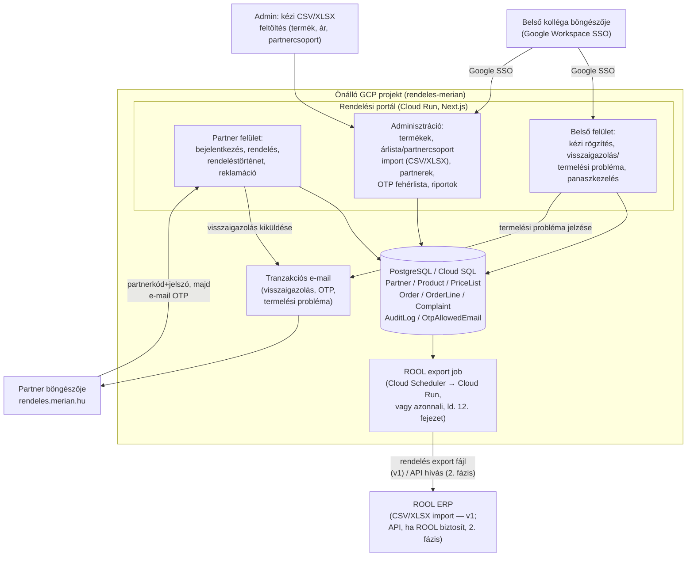

# Rendelésfelvevő portál — tervezési dokumentum

> Státusz: tervezési fázis. Ez a dokumentum **nem tartalmaz kódot**, célja az
> architektúra, az adatmodell, a képernyők és a bevezetési ütemterv rögzítése,
> mielőtt fejlesztés indulna. A tartalom a Szécsi Borbálával (kereskedelmi
> értékesítő) és Jánosa-Dér Anikóval (gazdasági igazgató) folytatott
> e-mail-egyeztetésekből (2026.09.07–2026.09.11), valamint a felhasználó által
> megadott funkciólistából lett szintetizálva. A stílusa és tagolása szándékosan
> követi a testvérprojekt (Billingo → IMA kimenő számla integráció, ugyanebben a
> repóban, `docs/tervezes.md`) mintázatát, mert ugyanaz az admin-app architektúra
> (Next.js + Prisma/PostgreSQL, Cloud Run + Cloud SQL, e-mail-OTP hitelesítés,
> kézzel frissíthető import/cache minták) jól illeszkedik erre a feladatra is —
> lásd 3. és 5. fejezet.

## 1. Cél és háttér

### 1.1 A jelenlegi (kézi) folyamat

Szécsi Borbála 2026.09.07-i leírása alapján a mai rendelésfelvétel így néz ki:

1. A partner **e-mailben vagy telefonon** adja le a rendelését.
2. Az e-mailes rendelés jelenleg **három, egymástól eltérő formában** érkezik:
   - a partner saját formátumú PDF-je (nincs egységes adatszerkezet),
   - a partner szabad szövegű e-mailje (csak termék név + mennyiség),
   - Balázs / Ottó (kereskedelmi kollégák) által továbbított partneri igény
     (szintén termék név + mennyiség).
3. A kollégák az e-mailben érkezett rendeléseket **kinyomtatják** — ez a lépés
   feleslegesnek bizonyult, tisztán a rögzítés megkönnyítésére szolgál.
4. A rendelést egy erre kijelölt munkatárs (Virág — emellett más feladata is
   van) **manuálisan rögzíti a ROOL-ba** (a cég vállalatirányítási / ERP
   rendszere).
5. A ROOL-ból kapott **VMS-számot** felírják a kinyomtatott rendelésre, majd
   lefűzik.

Ez a folyamat lassú, hibalehetőséget rejt (nincs egységes adatszerkezet,
kézi gépelés), és feleslegesen köt le munkaidőt egyetlen kollégánál.

### 1.2 A cél

Egy **önálló, webes rendelésfelvevő portál**, amelyen keresztül a partner saját
maga adja le a rendelését — egységes, validált adatszerkezetben —, amit a
rendszer közvetlenül fel tud dolgozni a ROOL felé (lásd 12. fejezet), kiváltva a
nyomtatást és a kézi gépelést. Ezt a megoldást az e-mail-egyeztetésben mindkét
felvázolt alternatíva közül (egységes Excel-sablon körlevélben vs. webes
felület) **Jánosa-Dér Anikó explicit a webes felületet preferálta**
(2026.09.07, Szécsi Borbála közvetítésével), ezért ez a dokumentum kizárólag
ezt az irányt tervezi tovább.

### 1.3 A felhasználó által megadott alapkövetelmények (2026.09.15)

| # | Követelmény | Hol tárgyalja ez a dokumentum |
|---|---|---|
| 1 | Webes felület a rendeléshez | 16. fejezet (UI), 17. fejezet (GCP) |
| 2 | Partnerkezelés | 4. Adatmodell (`Partner`), 14. fejezet (CRM) |
| 3 | Egalizált (egységes) termékkör felrögzítve | 7. fejezet |
| 4 | Termékkörhöz kapcsolódó specifikáció (hűtött, gyártási idő, stb.) | 7.2 |
| 5 | Minimális rendelési mennyiség meghatározás | 9. fejezet |
| 6 | Visszaigazolás — mennyire erőltessük? | 10. fejezet |
| 7 | Riportálás: ki mit mikor rendelt | 13. fejezet |
| 8 | Minimális CRM | 14. fejezet |
| 9 | Árlista frissítése | 8. fejezet |
| 10 | Partnercsoportok + csoportáras a ROOL-ból | 8. fejezet |
| 11 | Saját kézi rögzítés engedélyezése | 11. fejezet |
| 12 | Visszaigazolásban módosítási lehetőség, ROOL-ba kerülés után zárolás | 6. fejezet, 12.3 |
| 13 | Visszajelzés, ha a termelés nem tudja teljesíteni | 10.3 |
| 14 | Rendelések 2 nap múlva teljesülnek | 9.3 |
| 15 | Rendelés-panaszkezelés | 15. fejezet |
| 16 | GCP-publikálás, `rendeles.merian.hu`, partner-login + e-mail OTP | 5. fejezet, 17. fejezet |
| 17 | Termék/adat felvitel CSV/XLSX importtal | 7.3, 8.3 |

### 1.4 Érintett márkák

A céghez (Merian Foods Élelmiszeripari Kft.) az e-mail aláírások alapján több
márka/leányvállalat tartozik: **Rex Ciborum** (Orosháza, 1896), **Napsugár-Trade**
és **Orsi** (1982). A termékkatalógusnak és a partnercsoportoknak márkánként/
divíziónként is szűrhetőnek kell lennie (ld. 7.1, `Product.brand`).

## 2. Érintett szerepkörök

| Szerepkör | Kicsoda | Fő tevékenység |
|---|---|---|
| **Partner** | Külső vevő (bolt, lánc, vendéglátóhely) | Bejelentkezés, rendelés leadása, rendeléstörténet, reklamáció |
| **Ügyfélszolgálat / kereskedelmi** | Belső kolléga (pl. Szécsi Borbála, Virág szerepköre) | Kézi rendelésrögzítés partner nevében, visszaigazolások/termelési probléma jelzése, reklamációkezelés |
| **Adminisztrátor** | Belső kolléga (pl. gazdasági igazgatóság) | Termékkatalógus, árlista, partnercsoportok, partnerek törzsadata, OTP fehérlista, riportok |
| **Vezetői / riport nézet** (opcionális, 2. fázis) | Vezetőség | Csak olvasó riport-hozzáférés |

A belső szerepkörök (ügyfélszolgálat, adminisztrátor) **Google Workspace SSO**-val
lépnek be — ugyanaz a minta, mint a testvérprojektben. A **partnerek** nem
tagjai a cég Workspace-ének, ezért nekik saját, portál-specifikus bejelentkezés
kell (ld. 5.2).

## 3. Javasolt architektúra



**Fő elv:** a testvérprojektben (Billingo↔IMA) bevált mintázat átvétele:
Next.js monolit egy Cloud Run szolgáltatásban, PostgreSQL Cloud SQL-en,
Google Workspace SSO a belső userekhez, e-mail-OTP a nem-Workspace
felhasználóknak (ott a külső könyvelőnek, itt a partnereknek), kézzel
indítható/frissíthető import a bizonytalan/instabil külső integrációkhoz
(ott az IMA referencia-cache-ek, itt a ROOL felé irányuló export és a ROOL
felől érkező ár-/partnercsoport-import — ld. 8.3, 12. fejezet). Ez a
konzervatív választás a testvérprojekt saját tapasztalatából adódik: ott az
IMA API élő beküldése megbízhatatlannak bizonyult, és a kézi/fájlalapú
tartalék út (CSV export) lett a bevált megoldás — a ROOL oldalán a
szabványos adatbetöltés a levelezés idején még nem volt tisztázva
("péntekig beszéltek a ROOL-lal, hogy mi a szabványos adatbetöltése a
megrendeléseknek", Szécsi Borbála, 2026.09.07), ezért **v1-ben fájlalapú
(CSV/XLSX) exportra és importra tervezünk**, API-integrációra csak akkor,
ha a ROOL oldal ezt megerősítetten biztosítja (ld. 18. fejezet, Nyitott
kérdések).

## 4. Adatmodell (javaslat)

| Entitás | Legfontosabb mezők | Megjegyzés |
|---|---|---|
| **Partner** | `id`, `code` (belépési partnerkód), `name`, `taxNumber`, `billingAddress`, `shippingAddresses[]`, `bankAccount`, `paymentMethod`, `currency`, `partnerGroupId`, `status` (`active`/`suspended`), `orderingRules` (JSON: pl. engedélyezett rendelési napok) | A rendelés fejlécéhez szükséges adatok (2026.09.07-i kiegészítő e-mail: "a rendelést feladó partner adataira is szükség van... szállítási cím, bankszla, fizetési mód, pénznem") itt tárolódnak, a rendelés csak rájuk hivatkozik |
| **PartnerContact** | `id`, `partnerId`, `name`, `email`, `phone`, `role` (`orderer`/`billing`/`other`) | Minimális CRM alap — kapcsolattartók, ld. 14. fejezet |
| **PartnerUser** | `id`, `partnerId`, `loginCode`, `passwordHash`, `email` (OTP címzett), `active` | A partner belépési fiókja (lehet 1:1 a Partnerrel, vagy egy partnerhez több felhasználó — ld. 5.2) |
| **PartnerGroup** | `id`, `name` (pl. "Lánc A", "Vendéglátás", "Alapértelmezett"), `source` (`rool_import`/`manual`) | ROOL-ból importált árazási csoport, ld. 8.1 |
| **StaffUser** | `id`, `email` (Workspace), `name`, `role` (`ugyfelszolgalat`/`adminisztrator`/`vezetoi`) | Belső, Google SSO-s felhasználó — ugyanaz az RBAC-minta, mint a testvérprojektben |
| **ProductCategory** | `id`, `name`, `brand`, `requiresRefrigeration` (bool), `storageTempRange`, `productionLeadTimeDays`, `defaultMinOrderQty`, `defaultOrderUnitMultiple`, `shelfLifeDays`, `allergenInfo` | Kategóriaszintű specifikáció — a termék örökli, egyedileg felülbírálható (ld. 7.2) |
| **Product** | `id`, `code` (árukód), `name`, `categoryId`, `brand`, `etkCode` (ld. nyitott kérdés, 18. fejezet), `packagingUnit` (kiszerelési egység, pl. "rekeszes"), `quantityUnit` (mennyiségi egység), `orderUnitMultiple` (rendelési egység — felülbírálja a kategóriát, ha kitöltött), `minOrderQty` (felülbírálja a kategóriát, ha kitöltött), `vatRate`, `active`, `availableFrom`/`availableTo` (nullable — szezonalitás) | Az "egalizált termékkör" — egységes, központilag karbantartott katalógus |
| **PriceListEntry** | `id`, `partnerGroupId`, `productId`, `unitPrice`, `currency`, `validFrom`, `importBatchId` | ROOL-ból importált, csoportonkénti ár — verziózott (ld. 8.2) |
| **PriceListImportBatch** | `id`, `importedById`, `source` (`csv`/`xlsx`), `fileName`, `rowCount`, `errorCount`, `createdAt` | Import-napló, hibás sorok visszakereshetők |
| **Order** | `id`, `orderNumber` (megjelenített rendelésszám, pl. `2026-0001548`), `partnerId`, `orderType` (`normal`/`akcios`), `status` (ld. 6. fejezet), `createdById` (partner vagy belső user, ld. 11.), `requestedDeliveryDate`, `confirmedDeliveryDate`, `shippingAddressId`, `paymentMethod`, `currency`, `cutoffAppliedAt`, `roolExportBatchId` (nullable), `roolVmsNumber` (nullable), `lockedAt` (nullable — ld. 12.3) | Egy rendelés fejléce |
| **OrderLine** | `id`, `orderId`, `productId`, `productCodeSnapshot`, `productNameSnapshot`, `quantity`, `quantityUnit`, `unitPriceSnapshot`, `netAmount`, `vatRate`, `vatAmount`, `grossAmount`, `fulfillmentStatus` (`pending`/`confirmed`/`short`/`unavailable`), `fulfilledQuantity` (nullable) | A "fix adatok" listája (2026.09.07-i e-mail): árukód, áru név, ETK, darab (gyűjtő), kiszerelési egység, mennyiség, mennyiségi egység, egységár, nettó érték, adó mérték, adó érték, bruttó érték — mindegyik **snapshot**-ként tárolva rendeléskor, hogy egy utólagos ár-/termékváltozás ne írja át a már leadott rendelést |
| **OrderAuditLog** | `id`, `orderId`, `actorType` (`partner`/`staff`/`system`), `actorId`, `action` (`created`/`modified`/`submitted`/`exported_to_rool`/`fulfillment_updated`/`cancelled`), `before`/`after` (JSON), `createdAt` | Ki-mit-mikor módosított — a riportálás és a "módosítható, amíg ROOL-ba nem kerül" szabály (ld. 6., 12.3) ellenőrizhetőségéhez |
| **Complaint** | `id`, `type` (`partner_b2b`/`consumer`), `partnerId` (nullable — a fogyasztói panasz nem feltétlenül regisztrált partnertől jön), `orderId` (nullable), `category`, `subcategory`, `description`, `attachments[]`, `contactName`, `contactAddress`, `contactEmail`, `contactPhone`, `purchaseLocation`/`purchaseDate`/`receiptNumber`/`productCode`/`purchasedQty` (csak `consumer` típusnál), `status` (`new`/`in_progress`/`resolved`/`rejected`), `assignedToId`, `resolutionNote`, `createdAt` | A két űrlap közös táblája, típus szerint eltérő kitöltött mezőkkel — ld. 15. fejezet |
| **OtpAllowedEmail** *(csak belső staff OTP-hez, ha van nem-Workspace belső user)* | mint a testvérprojektben | A partner-OTP a `PartnerUser.email`-t használja, nem külön fehérlistát (ld. 5.2) |

## 5. Hitelesítés és jogosultságok

### 5.1 Belső felhasználók (staff/admin)

**Google Workspace SSO**, domain-korlátozással — 1:1 átvétel a testvérprojekt
5. fejezetéből. Szerepkörök: `ugyfelszolgalat` (kézi rendelésrögzítés,
visszaigazolás/termelési probléma jelzés, reklamációkezelés),
`adminisztrator` (mindez + termékkatalógus, árlista/partnercsoport import,
partnertörzs, riportok, felhasználó-kezelés), `vezetoi` (csak olvasó riport,
opcionális 2. fázis).

### 5.2 Partnerek — kétfaktoros belépés

A 2026.09.11-i e-mail konkrét javaslata alapján:

1. **Első faktor**: a partner a portálon kapott **partnerkód + jelszó**
   párossal jelentkezik be. A partnerkódot és a kezdeti jelszót az
   adminisztrátor hozza létre a Partnerek oldalon (ld. 16.7); a partner az
   első belépéskor jelszót cserélhet.
2. **Második faktor**: sikeres első faktor után a rendszer egy 6 jegyű,
   rövid érvényességű (~10 perc) egyszer használatos kódot küld a
   `PartnerUser.email` címre — ugyanaz az OTP-minta, mint a testvérprojekt
   külső könyvelői bejelentkezésénél, csak itt nincs fehérlista-ellenőrzés
   (a partnerkód+jelszó már maga az azonosítás), közvetlenül a regisztrált
   e-mail címre megy a kód.
3. Sikeres OTP után jön létre a munkamenet.
4. **Rate limitelés** a jelszó- és OTP-kísérletekre (pl. óránként max N
   próbálkozás partnerkód/IP szerint) a brute force ellen.
5. Egy partnerhez (`Partner`) opcionálisan **több `PartnerUser`** is
   tartozhat (pl. bolt vezetője + helyettes) — ez nyitott kérdés, hogy a
   partnerek ezt kérik-e, ld. 18. fejezet.

### 5.3 Fogyasztói panasz — nincs bejelentkezés

A "Fogyasztói panasz" űrlap (ld. 15.2) szándékosan **nyilvánosan elérhető,
bejelentkezés nélküli** oldal — a végfelhasználó (nem regisztrált partner)
bárhonnan kitöltheti.

## 6. Rendelés életciklus

```
piszkozat (draft) → beküldve (submitted) → visszaigazolva (confirmed)
        │                    │                       │
        │                    └──(partner/staff mód.)──┘  ← amíg nincs ROOL-exportálva
        │
        └──(elvetve)──> törölve (cancelled)

visszaigazolva → ROOL-exportálva (rool_exported, ZÁROLT — nincs több módosítás)
                        │
                        ├──> teljesítve (fulfilled)
                        └──> részben teljesítve / elmaradt (partially_fulfilled / short)
                                   → termelési probléma e-mail a partnernek (ld. 10.3)
```

1. **`draft`** — a partner (vagy a nevében rögzítő belső kolléga, ld. 11.)
   éppen állítja össze a kosarat; ekkor még nincs sorszám, nincs zárolás.
2. **`submitted`** — a partner (vagy a belső kolléga) rákattint a "Rendelés
   véglegesítése", majd "Beküldés" gombra (2026.09.11-i e-mail folyamatterve).
   Ekkor generálódik az `orderNumber`, és a `requestedDeliveryDate` a cutoff
   time és a 2 napos teljesítési szabály alapján számolódik (ld. 9.3).
3. **`confirmed`** — a rendszer **azonnal, automatikusan** visszaigazolást
   küld (rendelésszám + szállítási dátum, ld. 10.1) — ez felváltja a korábbi
   "hallgatólagos beleegyezés" gyakorlatot (ld. 10. fejezet indoklása).
4. **Módosítás**: a `submitted`/`confirmed` állapotú rendelés a partner
   vagy a belső kolléga által **még szabadon szerkeszthető**, amíg a ROOL-export
   le nem futott rá (ez a felhasználó explicit kérése: "A visszaigazolásba
   kerüljön be módosítási lehetőség. Amikor átkerül a ROOL-ba, utána nem
   lehet módosítani."). Minden módosítás `OrderAuditLog` bejegyzést kap.
5. **`rool_exported`** — a rendelés bekerült a ROOL-exportba (ld. 12.
   fejezet) — **innentől a portálon nem szerkeszthető** (a mezők csak
   olvashatók, egy "Zárolva — ROOL-ban" jelzéssel). További módosítás csak
   a ROOL-ban, belső ERP-folyamattal lehetséges.
6. **`fulfilled`** / **`partially_fulfilled`** / **`short`** — a belső
   kolléga (vagy egy ROOL-ból visszaolvasott állapot, ha lesz ilyen
   integráció) jelzi a tényleges teljesítést; eltérésnél a rendszer
   termelési probléma e-mailt küld (ld. 10.3).
7. **`cancelled`** — a partner vagy a belső kolléga `draft`/`submitted`/
   `confirmed` állapotból törölheti, indoklással; `rool_exported` utáni
   állapotból **nem** törölhető a portálról.

## 7. Termékkatalógus és specifikáció

### 7.1 Egalizált termékkör

A "termékkör felrögzítve" követelmény azt jelenti, hogy a portálon **egy
központi, karbantartott `Product` katalógus** van — a partner **nem írhat be
szabad szöveges terméknevet**, csak a katalógusból választhat. Ez pontosan a
2026.09.11-i e-mail célja is: "miután a terméket és a mennyiséget
kiválasztotta, akkor a partnernek nem kellene ezen adatokat tudnia,
rögzítenie... ki tudnánk küszöbölni azt, hogy rosszul ad le rendelést."

### 7.2 Kategória-specifikáció

Minden termék egy `ProductCategory`-hoz tartozik, ami az alábbi,
**öröklődő, de termékszinten felülbírálható** specifikációkat hordozza:

| Specifikáció | Példa |
|---|---|
| Hűtést igényel-e | igen/nem + tárolási hőmérséklet-tartomány |
| Gyártási/átfutási idő | pl. 2 munkanap — ez korlátozhatja a legkorábbi szállítási napot rendelésnél nagy mennyiségre (2. fázis: mennyiségfüggő átfutás) |
| Alapértelmezett minimum rendelési mennyiség | ld. 9.1 |
| Alapértelmezett rendelési egység (többszörös) | ld. 9.2 |
| Szavatossági idő | napokban |
| Allergén infó | szabad szöveg / kódlista |

### 7.3 Import (CSV/XLSX)

A termékkatalógus és a specifikációk felvitele/frissítése **CSV és XLSX
import**-tal történik (a felhasználó explicit kérése), az adminisztrációs
felületen (ld. 16.6):

- Sablon letölthető (oszlopfejlécekkel, mintasorral).
- Feltöltéskor **sor-szintű validáció** (kötelező mezők, típusellenőrzés,
  létező kategória-hivatkozás) — hibás sorok listázva, a jó sorok
  importálhatók a hibásak nélkül is (opcionális "csak akkor importálj, ha
  minden sor hibátlan" kapcsolóval).
- Minden import `PriceListImportBatch`-ként naplózva (ki, mikor, hány sor,
  hány hiba) — ugyanaz a minta, mint a testvérprojekt kézi frissítésű
  referencia-cache-einél (`ImaGlaAccountCache` stb., `docs/tervezes.md` 4. és
  10. fejezet), csak itt nem külső API-lekérdezés, hanem fájlfeltöltés a
  forrás.

## 8. Árazás és partnercsoportok

### 8.1 Partnercsoportok a ROOL-ból

A felhasználó kérése szerint "Partner csoportok és partner csoportokhoz
kapcsolódó árak a ROOL-ból" — vagyis a **ROOL az árazás forrásrendszere**,
nem a portál. Javasolt folyamat v1-ben:

1. A ROOL-ból (export/riport) egy **CSV/XLSX exportot** kap az adminisztrátor
   partnercsoport + termék + ár hármasokkal.
2. Ezt a fájlt az adminisztrációs felületen **feltölti** (ugyanaz az
   import-mechanizmus, mint 7.3-ban) → `PriceListEntry` sorok jönnek létre/
   frissülnek, `validFrom` dátummal verziózva.
3. A rendelési felület mindig a **partner aktuális csoportjához tartozó,
   legutóbb érvényes árat** ajánlja fel — ez a "partnerhez tartozó ár" a
   2026.09.11-i e-mail rendelési-felület-vázlatából.

### 8.2 Árlista frissítése

Az árlista **verziózott** (`validFrom` mezővel) — egy új import nem felülírja
csendben a régi árat, hanem új, későbbi érvényességű sort hoz létre; a
rendszer mindig a rendelés dátumára érvényes árat választja. Ez lehetővé
teszi az utólagos ellenőrzést ("milyen áron rendelt a partner adott napon"),
és összhangban van azzal, hogy az `OrderLine.unitPriceSnapshot` a
rendeléskor érvényes árat rögzíti (ld. 4. fejezet) — egy későbbi árváltozás
nem írja át a már leadott rendelést.

### 8.3 Kapcsolat a ROOL-lal — nyitott kérdés

Az e-mail-egyeztetés idején a ROOL felőli szabványos adatbetöltés még nem
volt tisztázva ("péntekig beszéltek a ROOL-lal" — Szécsi Borbála,
2026.09.07). Amíg nincs megerősített, kétirányú API, **v1-ben mindkét irány
fájlalapú**: árlista/partnercsoport **befelé** (ROOL → portál, kézi import),
rendelés **kifelé** (portál → ROOL, export, ld. 12. fejezet). Ha a ROOL
később API-t biztosít, ez a két pont cserélhető élő integrációra anélkül,
hogy az adatmodell vagy a UI érdemben változna (ugyanaz a lecke, mint a
testvérprojekt IMA-beküldésénél, ahol a végleges, megbízható út is a
fájlalapú export lett — `docs/tervezes.md` 8.0 fejezet).

## 9. Rendelési szabályok és validáció

### 9.1 Minimum rendelési mennyiség

Minden termékhez (vagy kategória-alapértelmezésből öröklődően) tartozik egy
`minOrderQty`. Ha a partner ez alatt próbál rendelni, a felület a
véglegesítés előtt jelez: **"A termék jelenleg nem rendelhető ilyen kis
mennyiségben. Minimum rendelhető mennyiség: N."**

### 9.2 Rendelési egység (többszörös)

A 2026.09.11-i e-mail konkrét példája szerint, ha a rendelési egység 10 db,
és a partner 15-öt írt be, a felület valós idejű visszajelzést ad:

> A termék rendelési egysége 10 db.
> Kérjük, 10 / 20 / 30 db mennyiséget adjon meg.

Ezt kliens oldalon (azonnali visszajelzés gépelés közben) **és**
véglegesítéskor szerver oldalon is ellenőrizni kell (a kliens oldali
validáció kényelmi funkció, nem biztonsági határ).

### 9.3 Szállítási nap és cutoff time

- **A rendelés a beérkezéstől számított 2 nap múlva teljesül** (a felhasználó
  explicit szabálya) — ez az alapértelmezett `requestedDeliveryDate`
  számítás: `beérkezés dátuma + 2 nap`, a napi **cutoff time**-mal korrigálva
  (a cutoff utáni beérkezés a következő naptól számítva csúszik +1 napot —
  a pontos cutoff órát admin állítja be, ld. 16.6, kategóriánként is
  eltérhet, ha a gyártási átfutási idő ezt indokolja, ld. 7.2).
- Emellett egyes termékeknél/partnereknél **korlátozott szállítási napok**
  is lehetnek (pl. csak keddi/csütörtöki szállítás egy adott útvonalon) — ha
  a számított dátum nem esik engedélyezett napra, a rendszer a legközelebbi
  érvényes napot ajánlja: **"A termék következő szállítási napja: szeptember
  15."** (2026.09.11-i e-mail konkrét szövegjavaslata).
- Bejelentkezés után a partner rögtön látja (2026.09.11-i e-mail konkrét
  UI-javaslata):

  > Üdvözöljük, CBA X üzlet!
  > Következő elérhető szállítás: 2026.09.12.
  > Rendelés leadási határidő: 2026.09.11. 14:00

### 9.4 Termék nem rendelhető

Ha egy terméket ideiglenesen kivontak a rendelhetők köréből
(`Product.active = false`, vagy `availableTo` lejárt), a felület nem is
ajánlja fel, illetve ha egy folyamatban lévő kosárban már szerepelt és
időközben inaktívvá vált: **"A termék jelenleg nem rendelhető."**

## 10. Visszaigazolás

### 10.1 Mennyire erőltessük? — javaslat

A korábbi gyakorlat (2026.09.07-i e-mail) **"hallgatólagos beleegyezés"**
volt: nincs explicit visszaigazolás, csak a hiányzó/nem szállítandó
tételekről jön visszajelzés. A 2026.09.11-i e-mail viszont már konkrét
visszaigazoló szöveget vázol fel ("Rendelésszám: 2026-0001548, Szállítás:
2026.09.12."), ami arra utal, hogy ez az álláspont azóta változott. Javasolt
kompromisszum, ami mindkét igényt lefedi **és** olcsó (nem igényel
kézi beavatkozást minden rendelésnél):

1. **Automatikus visszaigazolás minden beküldött rendelésre**, azonnal
   (rendelésszám + tervezett szállítási dátum) — ez a "köszönjük a
   megrendelést" szint, ld. 10.2. Ez nem igényel kézi jóváhagyást, tisztán a
   rendszer generálja a beküldéskor kiszámolt adatokból.
2. **Csak eltérés esetén megy külön, kézi kezdeményezésű e-mail** — ha a
   termelés/raktár nem tudja (vagy csak részben tudja) teljesíteni a
   rendelést, a belső kolléga ezt a portálon jelzi (ld. 10.3), és **ekkor**
   megy egy második, "módosított teljesítés" e-mail a partnernek.

Ezzel a rendszer nem "erőlteti túl" a visszaigazolást (nincs kézi
jóváhagyási lépés minden egyes rendelésnél, ami visszahozná a régi manuális
terhet), miközben mindkét fél számára világos, mi történt.

### 10.2 Automatikus visszaigazolás tartalma

Rendelés beküldésekor, azonnal, e-mailben és a felületen is:

- Rendelésszám
- Tervezett szállítási dátum
- Tételek listája (a 2026.09.07-i "fix adatok" listája szerint: árukód,
  terméknév, mennyiség, mennyiségi egység, egységár, nettó/adó/bruttó érték)
- Link a rendelés portálbeli megtekintéséhez/módosításához (amíg nem zárolt,
  ld. 6. fejezet) — ez a felhasználó explicit kérése ("A visszaigazolásba
  kerüljön be módosítási lehetőség").

### 10.3 Termelési probléma / nem teljesíthető rendelés

Ha a termelés/raktár nem tudja teljesíteni (részben sem, vagy csak
részben) a rendelést, a belső kolléga a rendelés-részletezőn
tételsoronként beállítja a `fulfillmentStatus`-t (`confirmed`/`short`/
`unavailable`) és a `fulfilledQuantity`-t, opcionális indoklással. Mentéskor
a rendszer **automatikusan e-mailt küld a partnernek**, csak az érintett
(eltérő) tételekkel — ez pontosan a korábbi "hallgatólagos beleegyezés"
gyakorlat megtartása az eltérések esetére, a felhasználó kérésének
megfelelően ("Lehessen visszajelezni, ha nem tudjuk rendezni a termelést és
nem tudjuk kiszolgálni").

## 11. Kézi rögzítés (belső felhasználók)

Az ügyfélszolgálati/kereskedelmi szerepkör a **partnerekével azonos
rendelési felületet** használja, egy plusz lépéssel az elején: kiválasztja,
melyik partner nevében rögzít (pl. mert a partner telefonon vagy e-mailben
adta le az igényét — ez a jelenlegi folyamat egy részének kiváltása marad,
amíg nem minden partner tér át önkiszolgáló rendelésre). A létrejövő
`Order.createdById` ilyenkor a belső userre mutat, de a rendelés egyébként
ugyanazt az életciklust követi (6. fejezet), és a partner is látja a saját
rendeléstörténetében.

## 12. ROOL export és zárolás

### 12.1 Export tartalma

A `confirmed` állapotú rendelések egy **ROOL-kompatibilis CSV/XLSX
exportba** kerülnek — az oszlopszerkezetet a ROOL-lal egyeztetett
"szabványos adatbetöltés" formátuma határozza meg (ld. 8.3, nyitott
kérdés). A rendelés fejléc-adatai (partner, szállítási cím, fizetési mód,
pénznem, dátum) és tételsorai (árukód, mennyiség, egységár stb., a 4.
fejezet `OrderLine` mezői) kerülnek bele.

### 12.2 Export ütemezése

Javaslat: **napi, cutoff time utáni ütemezett export** (Cloud Scheduler),
plusz egy "Exportálás most" gomb az adminisztrációs felületen sürgős esetre
— ugyanaz a manuális-indítású minta, mint a testvérprojekt referencia-cache
frissítésénél.

### 12.3 Zárolás

Az export pillanatában az érintett rendelések `rool_exported` állapotba
kerülnek, és **a portálon többé nem szerkeszthetők** — ez a felhasználó
explicit szabálya ("Amikor átkerül a ROOL-ba utána nem lehet módosítani").
A UI ilyenkor egy "Zárolva — feldolgozás alatt a ROOL-ban" jelzést mutat, a
mezők csak olvashatók.

## 13. Riportálás

Cél: **"ki mit mikor rendelt"**. Javasolt riportfelület (adminisztrátori és
vezetői nézet):

- **Rendeléslista** — szűrhető partner, partnercsoport, termék, dátumtartomány,
  státusz szerint; oszlopok: rendelésszám, partner, beküldés dátuma,
  szállítási dátum, összeg, státusz.
- **Termékenkénti összesítő** — adott időszakban melyik termékből mennyi
  fogyott, partnerenkénti bontásban is.
- **Partnerenkénti rendelési előzmény** — a Partner-részletező oldalról
  elérhető nézet (ld. 14. fejezet), az adott partner összes rendelése.
- **Export** — a riportlisták CSV/XLSX-ként letölthetők (Excel-alapú
  további elemzéshez).
- Az `OrderAuditLog` biztosítja, hogy módosítás esetén is visszakereshető,
  ki mit változtatott és mikor.

## 14. Minimális CRM

- **Partnertörzs** (ld. 4. fejezet `Partner`): alapadatok, számlázási és
  szállítási cím(ek), bankszámla, fizetési mód, pénznem, partnercsoport.
- **Kapcsolattartók** (`PartnerContact`): név, e-mail, telefon, szerep
  (rendelő/számlázási/egyéb) — több kapcsolattartó is rögzíthető partnerenként.
- **Partner-részletező oldal**: törzsadatok + rendeléstörténet +
  reklamációtörténet egy nézetben (ld. 16.5).
- **Belső jegyzet mező** a partnerhez (pl. "csak keddi szállítás", "mindig
  telefonon hívja vissza") — szabad szöveges, csak belső userek látják.
- Ez tudatosan **nem** egy teljes CRM (nincs értékesítési pipeline,
  kampánykezelés) — a felhasználó kérése szerint "minimális crm" a cél.

## 15. Panaszkezelés

Két, egymástól tartalmában eltérő űrlap (2026.09.11-i e-mail alapján, ld. 4.
fejezet `Complaint` entitás):

### 15.1 Partner panasz (B2B, bejelentkezve)

- Alapadatok: név, cím, e-mail cím, telefonszám (ha nem a bejelentkezett
  partner adatai jönnek elő automatikusan).
- Kategória (legördülő, a megadott lista szerint):
  - **Termékkel kapcsolatos**: hibás/nem megfelelő termék, sérült termék,
    hiányzó termék/hiányos csomag, nem a rendelt termék érkezett, minőségi
    probléma, lejárati idővel kapcsolatos probléma, csomagolási probléma.
  - **Rendeléssel/szállítással kapcsolatos**: rendelési eltérés, késedelmes
    szállítás, nem érkezett meg a rendelés, szállítási probléma.
  - **Számlázással/árral kapcsolatos**: hibás ár, számlázási eltérés,
    jóváírással kapcsolatos probléma.
  - **Egyéb**: egyéb reklamáció, szabad szöveges, limitált karakterszámú
    kifejtéssel.
- Opcionálisan a panasz egy konkrét `Order`-hez köthető (ha a portálon adta
  le a rendelést).
- **Fotó csatolási lehetőség.**

### 15.2 Fogyasztói panasz (nem bejelentkezett végfelhasználó)

- Vásárlás adatai: vásárlás helye, dátuma, blokk/számla száma, termék neve,
  termék cikkszáma, vásárolt mennyiség.
- Szabad szöveges, limitált karakterszámú probléma-leírás.
- Fénykép / blokk / számla feltöltése.

### 15.3 Belső feldolgozás

Mindkét típusú bejelentés egy közös **panaszkezelési munkasorba** kerül
(ügyfélszolgálati/adminisztrátori felület, ld. 16.9): állapot (`new`/
`in_progress`/`resolved`/`rejected`), felelős kijelölése, válasz/indoklás
rögzítése. A B2B panasz a partner-részletezőn is megjelenik (ld. 14.
fejezet).

## 16. UI tervezés (képernyők)

> A képernyők vizuális terve (mockupok) külön, a tervezési PDF mellékletében
> található — ez a fejezet a tartalmi/funkcionális leírás.

1. **Bejelentkezés (partner)** — partnerkód + jelszó, majd e-mail-OTP
   beviteli mező; hibás adatnál egységes, nem-enumeráló hibaüzenet.
2. **Rendelési főoldal / dashboard** — üdvözlés ("Üdvözöljük, CBA X üzlet!"),
   következő elérhető szállítási nap, aktuális rendelés leadási határidő,
   gyorsgomb "Új rendelés indítása" és "Rendeléseim".
3. **Termékválasztás / kosár** — kategóriák szerint böngészhető/kereshető
   katalógus, rendelési típus választó (normál/akciós), termékenként:
   terméknév, kiszerelés, mértékegység, partnerhez tartozó ár, rendelési
   egység és minimum mennyiség jelezve, mennyiség beviteli mező valós idejű
   validációval (ld. 9.1–9.2).
4. **Rendelés összesítése és véglegesítés** — tételek listája
   nettó/áfa/bruttó bontásban, szállítási cím/fizetési mód megerősítése
   (vagy módosítása, ha a partnernek több is van), "Rendelés véglegesítése",
   majd "Beküldés" gomb (a 2026.09.11-i e-mail kétlépéses folyamatterve
   szerint).
5. **Visszaigazolás** (felületen és e-mailben) — rendelésszám, szállítási
   dátum, tételek, "Rendelés módosítása" gomb (amíg nem zárolt).
6. **Rendeléseim** (partner) — rendeléstörténet státusz szerint szűrve,
   részletező nézettel.
7. **Reklamáció/panasz beküldése** — a 15. fejezet szerinti két űrlap.
8. **Ügyfélkezelés / partnerek** (belső) — partnerlista kereséssel/szűréssel,
   partner-részletező (törzsadat + kapcsolattartók + rendeléstörténet +
   panasztörténet + belső jegyzet).
9. **Kézi rendelésrögzítés** (belső) — mint a 3–4. képernyő, plusz partner
   kiválasztó lépés az elején.
10. **Rendelés-részletező, teljesítés jelzése** (belső) — tételsoronkénti
    `fulfillmentStatus` beállítás, termelési probléma e-mail kiküldése.
11. **Adminisztráció — termékkatalógus** — lista + CSV/XLSX import (sablon
    letöltés, feltöltés, hibalista).
12. **Adminisztráció — árlista/partnercsoport import** — ugyanaz a
    import-minta, csoportonkénti/termékenkénti ár megtekintéssel,
    verziótörténettel.
13. **Adminisztráció — partnerek/belépési adatok** — partnerkód/jelszó
    kiosztás, aktiválás/felfüggesztés.
14. **Riportok** — a 13. fejezet szerinti listák és exportok.
15. **Panaszkezelési munkasor** (belső) — a 15.3 szerinti állapotkezelés.

## 17. GCP telepítés és domain

- **Önálló GCP projekt** (pl. `rendeles-merian`), a testvérprojekt
  `docs/kornyezetek.md` sablonjával megegyező lépésekkel: Cloud Run
  (Next.js standalone build) + Cloud SQL (PostgreSQL) + Secret Manager +
  Artifact Registry.
- **Egyedi domain**: `rendeles.merian.hu` — Cloud Run domain mapping (vagy
  HTTPS load balancer, ha a domain mapping régiókorlátja ezt indokolja),
  DNS `CNAME`/`A` rekord a Merian domain kezelőjénél.
- **Google OAuth kliens** — csak a belső (Workspace) userekhez kell, a
  partnerek saját login-flow-t használnak (ld. 5.2), nincs Google-fiók
  igényük.
- **Tranzakciós e-mail** (visszaigazolás, OTP, termelési probléma jelzés,
  panasz-visszaigazolás) — dedikált feladó cím (pl.
  `rendeles@merian.hu` vagy `noreply@merian.hu`) SMTP-n keresztül, a
  testvérprojekt mintája szerint (app-jelszavas Gmail SMTP, vagy tranzakciós
  email szolgáltató, ha a volumen indokolja).

## 18. Bevezetési ütemterv (fázisok)

1. **0. fázis — Infra-alap**: GCP projekt, Cloud SQL, Cloud Run, domain
   mapping, alap Next.js váz, Prisma séma.
2. **1. fázis — Katalógus és partnertörzs**: termékkatalógus + kategória-
   specifikáció CSV/XLSX importtal, partnertörzs + partnercsoport +
   árlista import, admin felület.
3. **2. fázis — Rendelési folyamat**: partner bejelentkezés (kód+jelszó+OTP),
   rendelési felület, validációk (min. mennyiség, rendelési egység, cutoff/
   szállítási nap), automatikus visszaigazolás.
4. **3. fázis — Belső folyamatok**: kézi rendelésrögzítés, teljesítés-
   jelzés/termelési probléma e-mail, ROOL export (CSV/XLSX), zárolási
   logika.
5. **4. fázis — Riportálás és CRM**: riportfelület, partner-részletező,
   belső jegyzetek.
6. **5. fázis — Panaszkezelés**: két űrlap, belső munkasor.
7. **6. fázis (opcionális, később)**: élő ROOL API-integráció, ha a ROOL
   ezt biztosítja; vezetői riport-nézet; több `PartnerUser` egy partnerhez.

Az egyes fázisok **egymásra épülnek, de önmagukban is élesíthetők** — pl. az
1. fázis (katalógus + partnertörzs) már önmagában leváltja a "egységes
Excel-sablon" ötletet, ha a 2. fázis (webes rendelés) csúszna.

## 19. Nyitott kérdések / feltételezések

- **"ETK" mező jelentése** (a 2026.09.07-i e-mail "fix adatok" listájából:
  "árukód, , áru név, ETK, darab (gyűjtő)...") — nem egyértelmű a
  rövidítés (élelmiszerlánc-kód? egyedi termékkód? vámtarifaszám?). A
  `Product.etkCode` mező helyet kap az adatmodellben, de a pontos
  jelentést/formátumot Szécsi Borbálával/a ROOL-lal egyeztetni kell import
  előtt.
- **ROOL szabványos adatbetöltési formátuma** — az e-mail-egyeztetés idején
  még nem volt lezárva ("péntekig beszéltek a ROOL-lal"). Az export
  oszlopszerkezete (12.1) ettől függ, ezt véglegesíteni kell a fejlesztés
  megkezdése előtt.
- **Egy partnerhez hány `PartnerUser` tartozhat** — jelenleg 1:1 feltételezés
  (a "partnerkód" is erre utal), de ha egy boltlánc egyszerre több
  telephelyről rendel egy közös partnerkóddal, ezt tisztázni kell.
- **Kedvezmények jelzése a partner felé** — a 2026.09.07-i e-mailben
  Szécsi Borbála jelezte, hogy erre külön válaszol ("Erre holnap fpgpk
  tudni válaszolni") — a csatolt levelezésekben nincs további részlet, ezért
  ez a dokumentum egyelőre **nem tervez külön kedvezmény-motort**; a
  `PriceListEntry` szerkezete (partnercsoportonkénti ár) implicit kezeli az
  egyszerű, csoportos kedvezményt, de tétel-szintű/akciós kedvezmény-logika
  külön egyeztetést igényel.
- **Mennyiségfüggő gyártási átfutás** — a `ProductCategory.productionLeadTimeDays`
  jelenleg fix, nagy mennyiségnél hosszabb átfutást igénylő eset (pl. egyedi
  gyártás) nincs modellezve — ha ez üzleti igény, 2. fázisban bővíthető.
- **Devizás rendelés** — a `Partner.currency` mező jelen van, de nincs
  egyeztetve, hogy van-e ténylegesen nem-HUF rendelő partner, és ha igen,
  kell-e árfolyam-kezelés (a testvérprojekt már tartalmaz ehhez hasonló
  logikát a számlaoldalon, átvehető minta, ha szükséges).
