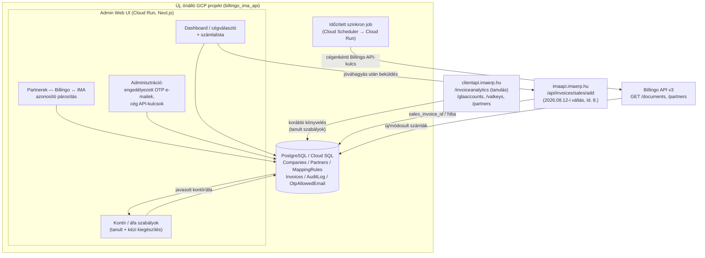

# Billingo → IMA kimenő (vevői) számla integráció — tervezési dokumentum

> Státusz: tervezési fázis. Ez a dokumentum **nem tartalmaz kódot**, célja az
> architektúra, az adatmodell, a két külső API (Billingo, IMA) integrációjának és a
> bevezetési ütemtervnek a rögzítése, mielőtt fejlesztés indulna. A stílusa és
> tagolása szándékosan követi egy testvérprojekt (szállítói/bejövő
> számlák) `docs/tervezes.md`-jét, mert ugyanazt az admin-app
> mintázatot (Next.js + Prisma/PostgreSQL + Google SSO, cégenkénti RBAC,
> tanulható kontír/áfa szabálytár) vesszük át a kimenő (vevői) oldalra.

## 1. Cél és háttér

A cég **Billingóban állítja ki** a kimenő (vevői) számlákat, a könyvelés viszont
**IMA-ban** történik. Ma ez feltehetően kézi/CSV-alapú átvitel — a cél egy admin
webalkalmazás, ami:

1. **Lekérdezi a Billingóban kiállított számlákat** (Billingo API v3).
2. **Kontírt (főkönyvi szám) és áfa kulcsot javasol** soronként, a korábbi IMA
   könyvelésből (`/invoiceanalytics`) **tanult szabályok** alapján, amelyeket a
   könyvelő **ki tud egészíteni/felülbírálni**.
3. **Könyvelői jóváhagyás** után a számlát **közvetlenül beküldi az IMA API-n**
   keresztül, kontír/áfa/partner adatokkal.
4. Naplózza az eredményt (siket/hibás beküldés), és lehetővé teszi az újrapróbálást.

Ez a bejövő (szállítói) oldal tükörképe: ott a PDF-ből AI nyeri ki az adatokat, itt a
Billingo API adja készen a strukturált adatot — az osztályozási (kontír/áfa tanulás),
jóváhagyási és IMA-beküldési logika viszont nagyrészt átvehető.

## 2. Érintett rendszerek és API-k

### 2.1 Billingo API v3

- Referencia: `docs/billingo-api/openapi.yaml` (a felhasználótól kapott hivatalos leírás).
- **`GET /documents`** — kimenő számlák listázása, szűrhető dátum/partner/típus/fizetési
  státusz szerint. Ez lesz az időszakos szinkron alapja.
- **`Document`/`DocumentItem` séma** — partner, tételek, nettó/áfa/bruttó bontás; a
  `Vat` mező vagy százalék (`27%` stb.), vagy magyar különleges kód (`AAM`, `TAM`, `EU`,
  `EUK`, `MAA`, `ÁKK`, `F.AFA`, `FAD`, `K.AFA`, `AM`) — ezt kell megfeleltetni az IMA
  `vat_code`-nak (ld. 8.3).
- **`GET /partners`** — Billingo partnertörzs; ebből töltjük fel a `Partner` táblát
  (név, adószám, cím), amit a beküldő végpont (ld. 8. fejezet, 2026.08.12-i váltás óta
  `/api/invoices/sales/add`) üzleti adatból old fel IMA-oldalon automatikusan (ld. 4.
  Adatmodell, 8.1 — nincs kézi IMA-azonosító párosítási kényszer).
- Hitelesítés: Billingo API kulcs, **cégenként** (a Billingo fiók cégenként külön kulcsot
  ad ki) — ld. `Company.billingoApiKey`.

### 2.2 IMA API — két host, két releváns végpont

Ugyanaz a két-host mintázat igazolódott vissza, mint a szállítói oldalon
(`<sibling-project>/docs/tervezes.md` 12.5.1 fejezet), a felhasználó élesben
megerősítette a kimenő oldalra is:

| Host | Mire való | Forrás |
|---|---|---|
| **`https://imaapi.imaerp.hu`** | ~~Kizárólag a számla-beküldő végpontok~~ — ⚠️ **2026.09.10-i javítás: TÉVES, ld. 18. fejezet.** A ténylegesen használt, megerősített beküldő végpont is a `clientapi.imaerp.hu` hoston van; ez a host gyakorlatilag nem használt (csak a régebbi, elhagyott `/api/import/sales-invoice`-hoz tartozna, ld. lent). | Postman-gyűjtemény + 2 db docx (ld. lent), felhasználó által megerősítve |
| **`https://clientapi.imaerp.hu`** (`/api/` prefix **nélkül**) | Minden referencia-végpont ÉS (2026.09.10-től) a nyers számla-beküldés (`/invoices/sales/add`) is: `/glaaccounts`, `/vatkeys`/`/vatlist`, `/partners`, `/invoiceanalytics`, `/invoicesandequalisations`, `/invoices/sales/add` stb. | `docs/ima-api/openapi-clientapi.json`, ld. 18. fejezet a beküldés megerősítéséhez |

Két lehetséges beküldő végpont van a `imaapi.imaerp.hu` host alatt, dokumentálva:

1. **`POST /api/invoices/sales/add/{apikey}`** — nyers `header_data`/`lines_data` JSON,
   legacy `api-key`/`user`/`company` fejlécekkel (ld. `docs/ima-api/postman-sales-invoice-add.json`).
   Kötelező **létező `partner_id`** (vagy `partner` objektum, ha az IMA fel tudja oldani
   kóddal), és explicit `vat_code`/`gla_code` soronként.
2. **`POST /api/import/sales-invoice/{apikey?}`** — magasabb szintű, staging-alapú import
   végpont, ami JSON/CSV/XLSX/NAV-OSA-XML bemenetet fogad, és a partnert/áfát üzleti
   adatból (név, adószám, cím, szabad szöveg) próbálja **automatikusan** feloldani,
   hash-alapú duplikációvédelemmel (ld. `docs/ima-api/sales-invoice-import-endpoint.md`,
   a két kapott docx saját összefoglalója).

**Döntés — ⚠️ 2026.08.12-i váltás:** a v1 eredetileg a **`/api/import/sales-invoice`**
(2. opció) végpontra épült (2026.08.09-i pontosítás, felhasználói megerősítés alapján),
de éles beküldésnél ez a végpont IMA-oldali szerverhibába ütközött (HTTP 422,
`import_batch_id` NOT NULL hiba a saját staging→transfer lépésükben, ld. 8. fejezet
eleje) — ezért a könyvelő döntése alapján **visszaálltunk az 1. opcióra, a nyers
`/api/invoices/sales/add`-ra**. Gyakorlati következmények:

- **Nincs előzetes `imaPartnerId`-párosítási kényszer** — a partner a `partner` objektumban
  küldött üzleti adatokból (`customers_company`, `customers_vat_number`, cím) oldódik fel/
  jön létre automatikusan az IMA oldalon, tehát a beküldés nem blokkolható azon, hogy egy
  Billingo partnerhez még nincs kézzel hozzárendelt IMA azonosító (ld. 8.1, frissítve).
- A tétel-szintű `net_amount`/`vat_amount`/`gross_amount` mezőket **továbbra is mindig
  explicit küldjük** — a séma szerint (`docs/ima-api/openapi-clientapi.json`
  `SalesInvoiceLine`) explicit összegeknél nincs automatikus kerekítés-sor beszúrás, ami
  megerősíti a szállítói oldali tanulságot (12.4.1 fejezet, hiányzó összegek → váratlan
  áfa- és kerekítés-sor).
- A kontír (`gla_code`) és áfa kód (`vat_code`) az OpenAPI séma szerint **dokumentált,
  ténylegesen létező mező** a `SalesInvoiceLine`-on (a Postman-példák csak nem mutatták) —
  ezen a végponton nem "opcionális felülbírálás" egy Billingo-nyers érték mellett, hanem
  a jóváhagyott `MappingRule`-érték az **egyedüli, kötelező** ÁFA-forrás soronként (ld.
  8.2). Az első éles beküldésnél mindenképp érdemes ellenőrizni a visszakérdezett
  (`/invoiceanalytics`) könyvelést.
- Ennek a végpontnak **nincs** dokumentált staging/hash-alapú duplikációvédelme — helyette
  `SH_NO`(`invoice_external_id`)+`posting_date` egyezésnél HTTP 409-et ad, amit a saját
  `billingoDocumentId` alapú dedup (ld. 7. fejezet) egészít ki.

## 3. Javasolt architektúra



**Fő elv:** nincs n8n a képben (a forrás Billingo API-ból jön, strukturáltan — nincs
PDF-kinyerés/AI-agent lépés), az admin webalkalmazás maga végzi a szinkront, a
javaslatgenerálást és a beküldést egy Cloud Run szolgáltatásban + egy Cloud Scheduler
által ütemezett szinkron feladatban.

## 4. Adatmodell (javaslat)

| Entitás | Legfontosabb mezők | Megjegyzés |
|---|---|---|
| **Company** | `id`, `name`, `status` (`active`/`paused`), `billingoApiKey`, `imaApiKey`, `imaApiUser`, `imaApiCompany`, `primaryAdvanceGlaCode` (nullable) | Egy dokumentum / cég, mint a testvérprojektben. Az IMA API host-ok (`imaapi.imaerp.hu`, `clientapi.imaerp.hu`) kódba égetett konstansok, **nem** cégenkéntiek (ld. 2.2, ugyanaz a minta, mint a szállítói oldalon). A `primaryAdvanceGlaCode` az előlegszámla-tételek kontírjához, ld. 9.5 |
| **User** | `id`, `email`, `name`, `role` (`konyvelo`/`adminisztrator`) | Ugyanaz az RBAC-modell, mint a testvérprojektben (5. fejezet) |
| **CompanyUser** | `companyId`, `userId` | Cégenkénti hozzárendelés, ugyanazok az érvényességi szabályok (minden cégnél legalább egy könyvelő stb.) |
| **OtpAllowedEmail** | `id`, `email`, `note`, `addedById`, `createdAt` | Admin által kezelt fehérlista a nem-domain (nem Google Workspace SSO-s) felhasználók email-OTP bejelentkezéséhez — ld. 5. fejezet |
| **Partner** | `id`, `companyId`, `billingoPartnerId`, `name`, `taxNumber`, `address`, `imaPartnerCode` (nullable) | A beküldő végpont (ld. 8. fejezet) a partnert üzleti adatból (név/adószám/cím) oldja fel automatikusan, tehát az `imaPartnerCode` **nem blokkoló** kényszer, csak opcionális, ismert IMA-oldali kód rögzítésére (ld. 8.1) |
| **MappingRule** | `id`, `companyId`, `partnerId` vagy `productNamePattern`, `glaCode`, `vatCode`, `source` (`learned_invoiceanalytics` / `manual`), `confidence` (nullable) | A `/invoiceanalytics`-ból tanult, valamint a könyvelő által kézzel felvitt/felülírt szabályok közös tábla, forrás-jelöléssel (ld. 9. fejezet); a beküldésnél `gla_code`/`vat_code` mezőként megy ki (ld. 8.2, 2026.08.12-i váltás óta ezen a végponton nem "felülbírálás", hanem az egyedüli ÁFA-forrás) |
| **Invoice** | `id`, `companyId`, `billingoDocumentId` (unique), `billingoDocumentNumber`, `partnerId`, `status` (`synced`/`needs_review`/`approved`/`submitted`/`booked`/`failed`), `lines` (JSON: tételek + javasolt/jóváhagyott `glaCode`/`vatCode` soronként), `imaImportBatchId` (nullable), `imaIncomingInvoiceId` (nullable, 2026.08.12-i váltás óta nem töltődik), `imaSalesheaderId` (nullable), `imaPushError` (nullable), `createdAt`, `updatedAt` | Egy Billingo dokumentum = egy sor; a `billingoDocumentId` unique kulcs védi a duplikált szinkront. Az IMA-oldali azonosító a beküldő végpont válaszának `invoice_id` mezőjéből töltődik (ld. 8.2) |
| **AuditLog** | `id`, `companyId`, `actorId`, `action`, `entityType`, `entityId`, `before`/`after` (JSON), `createdAt` | Kontír/áfa szabály módosítás és IMA-beküldés naplózása, ugyanúgy mint a testvérprojekt `RuleAuditEntry`-je |
| **ImaGlaAccountCache** / **ImaVatKeyCache** | `id`, `companyId`, `code`, `name`, (`percent` a VAT-nál), `updatedAt`, unique `(companyId, code)` | 2026.08.14-i kiegészítés: az IMA számlatükör/áfa kulcs lista KÉZZEL frissíthető DB-másolata — a Kontír/áfa szabályok és Beállítások oldal a kontír/áfa combobox javaslatokhoz KIZÁRÓLAG ebből olvas, sosem hív ki élőben IMA-t oldalbetöltéskor (ld. 10. fejezet) |
| **ImaPartnerCache** | `id`, `companyId`, `imaPartnerId` (Int), `name`, `taxNumber` (nullable), `updatedAt`, unique `(companyId, imaPartnerId)` | 2026.08.14-i kiegészítés: az IMA partnerlista (`/partners`, `type=customer`) KÉZZEL frissíthető DB-másolata, ugyanazzal a "Frissítés" gombbal töltve, mint a fenti kettő — a Partnerek oldalon adja az adószám-alapú párosítás alapját a `Partner.imaPartnerCode`-hoz (ld. 10. fejezet 5. pont) |

## 5. Hitelesítés és jogosultságok

Két bejelentkezési mód, ugyanabban a NextAuth konfigurációban:

1. **Google Workspace SSO**, domain-korlátozással (example.com) — mint a
   testvérprojektben, ez marad az elsődleges belépési mód a cégen belüli munkatársaknak.
2. **Email OTP** — külsős/nem domain-email felhasználóknak (pl. külső könyvelő). A
   folyamat: a felhasználó megadja az email címét → a rendszer ellenőrzi, hogy szerepel-e
   az **`OtpAllowedEmail`** fehérlistán → ha igen, egy 6 jegyű, rövid érvényességű
   (~10 perc) egyszer használatos kódot küld emailben → a kód beírásával jön létre a
   munkamenet. Nem szereplő email esetén a rendszer **nem** árulja el, hogy az email cím
   ismeretlen-e (egységes "ha jogosult vagy, elküldtük a kódot" üzenet), hogy ne legyen
   email-enumerálási lehetőség.
   - **Admin felület** (`UI_Admin`): a fehérlista karbantartása (email hozzáadása/
     törlése, megjegyzés mezővel, pl. "Kovács Anna — külső könyvelő, XY Kft.").
     Kizárólag `adminisztrator` szerepkör érheti el — ugyanaz a jogosultsági elv, mint a
     testvérprojekt 5.1 fejezetében (adminisztrátor nem hoz létre üzleti szabályt, de a
     rendszer adminisztratív beállításait kezeli).
   - Rate limitelés kódkérésre és -beírásra (pl. óránként max N kísérlet email/IP
     szerint), hogy a kód brute-force-olható ne legyen.
   - Az OTP-vel bejelentkezett felhasználóknak is kell `User`/`CompanyUser` rekord és
     szerepkör — az OTP csak a *hitelesítés* módja, a jogosultsági modell (5.1–5.2,
     testvérprojekt mintája szerint) változatlanul érvényes.

A `role` (`konyvelo`/`adminisztrator`) és a cég-hozzárendelési szabályok (minden
felhasználó pontosan egy szerepkör, minden céghez legalább egy könyvelő) 1:1 átvétel a
testvérprojekt 5.1–5.2 fejezetéből.

## 6. Fő folyamat (számla életciklus)

```
synced → needs_review → approved → submitted → booked
   │            │            │  └──(visszavonás)──┘
   └────────────┴──────(kézi)┴──> rejected ──(visszavonás)──> needs_review
                                        └──(hiba)──> failed → (javítás után) submitted
```

1. **`synced`** — a szinkron job lekérte a Billingo dokumentumot, `Invoice` rekord
   létrejött/frissült.
2. **`needs_review`** — legalább egy tételsorhoz nincs (elég magabiztos) kontír/áfa
   javaslat, VAGY a partnerhez hiányzik az automatikus IMA-feloldáshoz szükséges
   adószám/cím (ld. 8.1).
3. **`approved`** — a könyvelő minden sorhoz jóváhagyta/beírta a kontírt és az áfa
   kulcsot (kötelező feltétel a beküldés előtt, mint a testvérprojektben).
4. **`submitted` → `booked`** — az IMA API hívás elindult; sikeres válasz esetén
   azonnal `booked` (az IMA válasza maga a megerősítés, nincs külön kézi lépés — ugyanaz
   a minta, mint a szállítói oldal 12.4 fejezetében), és eltárolja az
   `imaSalesInvoiceId`-t.
5. **`failed`** — hibás beküldés, a hibaüzenet eltárolva (`imaPushError`); a UI-n
   újrapróbálható, csak a hibás számlákat érintve (kötegelt "csak a hibásokat próbáld
   újra" logika, mint a testvérprojektben).
6. **`rejected`** (2026.08.12-i kiegészítés) — a könyvelő explicit kizárja a számlát a
   beküldésből (pl. téves adat, duplikátum, nem könyvelendő tétel), indoklás
   megadásával (`Invoice.rejectionReason`). Bármely, még nem `booked` státuszból
   elérhető kézi művelettel (`synced`/`needs_review`/`approved`/`failed` →
   `rejected`); `booked` számla nem utasítható el (az már ténylegesen bekönyvelődött
   IMA-ban). Az elutasítás visszavonható, ilyenkor a számla `needs_review`-ra kerül
   vissza (a könyvelőnek újra át kell néznie, mielőtt jóváhagyná).
7. **`approved` → `needs_review` (jóváhagyás visszavonása, 2026.08.14-i kiegészítés)**
   — könyvelői kérés: "ha elrontottunk egy megfeleltetést, a jóváhagyva státuszból
   lehessen visszavonni, hogy utólag módosítható legyen". Csak `approved` állapotból
   engedélyezett (`booked`/`submitted` számlát nem érint — az már ténylegesen elment
   IMA-nak), egyenként (`unapproveInvoice`, Számla-részletező) és tömegesen is
   (`bulkUnapproveInvoices`, Számlák oldal). A tételsorok jóváhagyott értékei
   megmaradnak (nem nullázódnak), csak a jóváhagyó/időpont törlődik — a könyvelő a
   meglévő adatokból kiindulva javíthat.

**Számlalista szűrés és tömeges műveletek** (2026.08.12-i kiegészítés): a Dashboard
státusz (`synced`/`needs_review`/`approved`/`submitted`/`booked`/`failed`/`rejected`)
és kelte-szerinti dátumtartomány (`docDate`) szerint szűrhető. Csak automatikusan
teljesen osztályozott (`synced`) számlák hagyhatók jóvá tömegesen (a `needs_review`
számlákat egyenként kell átnézni) — jóváhagyott/hibás számlák tömegesen beküldhetők
IMA-nak. Ha valamelyik könyvelő közben egy új szabályt vesz fel/tanul, a
**"Javaslatok újraszámolása"** gomb (Számlák oldal) a Billingo-adatok újralekérdezése
nélkül, azonnal újrafuttatja a javaslati motort a még nem jóváhagyott számlákra
(`recomputeSuggestionsForCompany`) — enélkül a korábban szinkronizált, de még jóvá nem
hagyott számlák javaslatai elavultak maradnának.

**Tömeges kontír/áfa javítás** (2026.08.14-i kiegészítés, könyvelői kérés: "tömegesen
tudjak szabályt kapcsolni számlákhoz vagy tömegesen tudjak áfa kulcsot vagy főkönyvi
számot beállítani"): a kijelölő checkbox-okkal a &bdquo;Kontír/áfa beállítása&rdquo;
gomb egy panelt nyit (`BulkMappingModal`, `InvoiceListTable.tsx`), ahol vagy egy
meglévő `MappingRule`-t választva (a szabály kimeneti mezői előre kitöltik az
alábbi mezőket), vagy közvetlenül megadva a kontírt/áfa kulcsot/áfa kontírt/előjelet,
a kijelölt számlák **MINDEN tételsorára** ráíródik a megadott érték
(`bulkSetInvoiceLineMapping`, `POST /api/companies/[companyId]/invoices/bulk-set-mapping`)
— minden mező opcionális, csak a ténylegesen kitöltöttek módosulnak. Csak még be nem
küldött (`synced`/`needs_review`/`approved`/`failed`) számlákat érint; ha egy már
jóváhagyott számlát módosít, az visszakerül `needs_review` állapotba (ld. 6. fejezet
7. pont) — a megváltozott megfeleltetést friss jóváhagyásnak kell megerősítenie.

**Számla-lista oszlopok és számla típusa** (2026.08.12-i UI-átalakítás): a csoportos
nézet a könyvelő visszajelzése alapján számlaszám, partner, teljesítés dátuma, nettó,
áfa, bruttó összeg, **számla típusa** és devizanem oszlopokat mutatja (a kelte
dátum a szűréshez marad, oszlopként nem jelenik meg). A "számla típusa"
(Előlegszámla/Végszámla/Normál számla) felismeréséhez **élő hibát találtunk és
javítottunk**: a Billingo-szinkron (`fetchBillingoDocuments`) korábban KIZÁRÓLAG
`type=invoice` szűrővel kérdezte le a `/documents` végpontot — ez a Billingo API-nál
egyetlen, kizárólagos érték (nem lista), tehát az `advance` (előlegszámla) típusú
bizonylatok **soha nem kerültek be** a rendszerbe. A javítás után a szinkron KÉT külön
lapozott lekérdezést futtat (`type=invoice` és `type=advance`), és minden
`type=invoice` bizonylatnál a Billingo `related_documents` mező alapján (nem üres =
egy korábbi előlegszámlát számol el) állapítja meg, hogy **normál** vagy **végszámla**
(`Invoice.hasAdvanceSettlement`, `invoiceKindLabel()` a `billingoApiClient.ts`-ben).
⚠️ Mivel ez a szinkron viselkedését módosítja, a meglévő cégeknél egy új
"Szinkronizálás most" futtatás visszamenőleg is behúzhatja a korábban kimaradt
előlegszámlákat (a `billingoLastSyncedInvoiceDate` dátumkorláton belül).

**Számla-részletező fej/tétel bontás** (2026.08.12-i UI-átalakítás): a fejrész
(partner, kelt dátum, Billingo teljesítés dátuma, fizetési határidő, fizetési mód,
devizanem) és a tételek (termék neve, nettó érték, áfa kulcs Billingo, áfa besorolás
IMA, árbevétel kontír, előjel, "milyen szabály futott le rá") külön blokkban
jelennek meg. Két kapcsolódó pontosítás:
- **ÁFA dátuma KÜLÖN mező** a Billingo eredeti teljesítés dátumától
  (`Invoice.vatFulfillmentDateOverride`, ld. 8.2) — korábban a könyvelői felülbírálás
  ugyanabba a `fulfillmentDate` oszlopba írt, ami jóváhagyás után véglegesen
  elfedte/felülírta a Billingo eredeti értékét. Mostantól a Számla-részletező mindkettőt
  külön mutatja, és csak a felülbírálás megy ki `vat_fulfillment_date`-ként (ha üres, a
  Billingo eredeti `fulfillmentDate` az alap, ld. `submitInvoiceToIma`).
- **"Milyen szabály futott le rá"** — a javaslati motor (`suggestMappingForLine`,
  `mappingRuleEngine.ts`) mostantól a ténylegesen illeszkedő `MappingRule` azonosítóját
  és egy olvasható feltétel-összegzését (`ruleId`/`ruleSummary`) is visszaadja, ezt
  tárolja a tételsor (`InvoiceLine.suggestedRuleId`/`suggestedRuleSummary`) — a
  korábbi "tanult"/"kézi" jelölés (forrás-badge) mellett most a szabály konkrét
  feltételei is látszanak a részletezőn.

## 7. Billingo szinkron

- Cégenkénti időzített job (Cloud Scheduler), ami `GET /documents`-szel lekéri az új/
  módosult számlákat (utolsó szinkron időbélyeg alapján szűrve).
- **Csak kiállított, nem sztornó** számlák kerülnek be alapból; a sztornó/helyesbítő
  bizonylatok kezelése (IMA `invoice_type: creditentr`/`storno`) külön vizsgálandó — ld.
  12. Nyitott kérdések.
- `billingoDocumentId` unique kulcs védi az ismételt szinkront ugyanarra a dokumentumra;
  módosult dokumentumnál a meglévő `Invoice` sor frissül, ha még nem `booked`.
- **Szinkron kezdő dátuma** (`Company.billingoSyncFromDate`, opcionális, Beállítások
  oldal): csak az ELSŐ szinkronra hat — enélkül egy újonnan induló cégnél is a teljes
  Billingo-előzményt (akár évekre visszamenőleg) lekérdezné a rendszer, ami se nem
  szükséges, se nem kívánatos egy frissen bevezetett cégnél (2026.08.11-i kiegészítés).
- **A `start_date` szűrő mindig a számla KELTÉRE (kiállítás dátuma) vonatkozik**
  (ugyanúgy a Billingo API-nál, mint a `billingoSyncFromDate` beállításnál) — ezért a
  MÁSODIK és további szinkronoknál NEM a szinkron *futtatásának* időpontja
  (`Company.lastBillingoSyncAt`) a szűrő alapja, hanem a `Company.billingoLastSyncedInvoiceDate`
  — az eddig LÁTOTT számlák legkésőbbi kelte. Ha a futtatási időpontot használnánk, egy
  visszamenőleges keltezésű, de csak KÉSŐBB Billingóban rögzített számla véglegesen
  kimaradna a szinkronból (2026.08.11-i javítás).
- **Devizás számlák árfolyam-ELLENŐRZÉSE** (`src/lib/exchangeRate.ts`, 2026.08.11-i
  kiegészítés): a Billingo `conversion_rate`-jét NEM cseréljük le (az a ténylegesen
  könyvelendő árfolyam) — de a Billingo csak az MNB árfolyamot ajánlja fel automatikusan
  a felhasználónak, egy attól eltérőt (pl. egy konkrét bank jegyzését) nem validál.
  Szinkronkor ezért összevetjük a számlán szereplő árfolyamot a cégen beállított
  hivatalos referenciával (`Company.useMnbExchangeRate`/`exchangeRateBank`, ugyanaz a
  minta, mint a testvérprojekt `resolveExchangeRate()`-je, csak fordított célra): MNB
  (`mnbExchangeRate.ts`) vagy egy konkrét bank (`napiarfolyamExchangeRate.ts`,
  napiarfolyam.hu). 5%-nál nagyobb eltérésnél (vagy hiányzó árfolyamnál) az `Invoice`
  `needs_review`-ra kerül, a `exchangeRateWarning` mezőben a magyarázattal. Hálózati/API
  hiba a referencia-lekérdezésnél NEM blokkolja a szinkront, csak a figyelmeztetés
  marad el arra a számlára — ugyanúgy nem élőben tesztelt az MNB/napiarfolyam.hu hívás,
  mint a testvérprojektben (ld. ottani 12.3 fejezet).
- **Csomagolt (batch) ÉS lapozáson-átívelően folytatható lekérdezés** (2026.08.12-i
  kiegészítés, könyvelői visszajelzés): az első verzió (`iterateBillingoDocumentBatches`
  generátor, EGY HTTP kérésen belül csomagolva) megvédett a memóriakockázattól (nagy
  cégnél a teljes bizonylat-halmaz egyben memóriába gyűjtése ugyanolyan kockázatot
  jelentett, mint a `/rules` oldal korábbi OOM incidense), DE a teljes szinkron
  ÖSSZESSÉGÉBEN továbbra is EGY HTTP kérés-válasz ciklus volt — hosszabb
  dátumtartománynál ez élesben Cloud Run **504 időtúllépést** okozott. A végleges
  megoldás: a `fetchBillingoDocumentBatch` (`billingoApiClient.ts`) HTTP
  KÉRÉSENKÉNT csak EGY csomagot (`pagesPerBatch` Billingo-oldal, alapból 2, azaz
  ~200 db) kérdez le, és egy szerializálható `cursor`-t ad vissza (típus + oldalszám).
  A `POST /api/companies/[companyId]/sync` route (`runBillingoSyncBatch`,
  `billingoSync.ts`) ezt a cursort fogadja/adja vissza — a kliens (`SyncControls.tsx`)
  egy ciklusban hívja a route-ot, amíg `done: true` nem érkezik, közben folyamatos
  állapotüzenetet mutatva. Így EGYETLEN HTTP kérés sem futhat bele az időtúllépésbe,
  függetlenül a teljes dátumtartomány méretétől. A "hány bizonylat lesz" kérdésre NEM
  kell külön lekérdezés: a Billingo válasz `total` mezője (a `DocumentList` sémában)
  már az ELSŐ oldal válaszában megérkezik. ⚠️ A `billingoLastSyncedInvoiceDate`
  kurzort továbbra is csak a TELJES szinkron VÉGÉN, egyszer írjuk (nem csomagonként/
  kérésenként) — mivel a Billingo a legfrissebb bizonylatot adja vissza ELSŐKÉNT, egy
  korábbi előretolás egy félbeszakadt szinkronnál véglegesen kihagyná a még
  feldolgozatlan RÉGEBBI csomagokat a következő futásnál. A `syncCompanyBillingoInvoices`
  kényelmi wrapper (in-process ciklus `runBillingoSyncBatch` felett) csak a CLI/Cloud
  Run Job (`npm run sync:billingo`) számára maradt meg, ahol nincs HTTP
  kérés-időkorlát — a böngészős "Szinkronizálás most" gomb NEM ezt hívja.

## 8. IMA beküldés

> ⚠️ **2026.08.12-i váltás**: a beküldés a **nyers `/api/invoices/sales/add/{apikey}`**
> végpontra épül (ld. `docs/ima-api/openapi-clientapi.json`
> `SalesInvoiceRequest`/`SalesInvoiceHeader`/`SalesInvoiceLine` sémája,
> `docs/ima-api/postman-sales-invoice-add.json`). A korábban választott
> `/api/import/sales-invoice/{apikey?}` (ld. 8.1–8.3 alábbi, immár **elavult**
> leírása a történeti kontextushoz) éles beküldésnél IMA-oldali szerverhibába
> ütközött: HTTP 422, `"Column 'import_batch_id' cannot be null"` a saját
> `incoming_invoices` staging→transfer lépésükben — ez az ő oldaluk hibája
> (a mi kérésünk a dokumentációjuknak megfelelő volt), és a küldött mezőkkel
> semmilyen módosítással nem volt megkerülhető. A könyvelő döntése alapján
> visszaálltunk a nyers végpontra, abban a feltételezésben, hogy az NEM megy át
> az ő staging+automatikus-transfer lépésükön. Az OpenAPI séma szerint a nyers
> végponton is van kontír-felülbírálás (`SalesInvoiceLine.gla_code`, nullable
> string) — ez korábban kockázatnak tűnt, mert a Postman-példák nem mutattak
> ilyen mezőt, de a szerver saját, generált sémája ténylegesen dokumentálja.
>
> ⚠️ **2026.08.14-i élő teszt MEGCÁFOLTA a fenti feltételezést**: a nyers
> végpont IS ugyanabba az `incoming_invoices` staging táblába ír (a hibaüzenet
> SQL-je ezt bizonyítja), tehát UGYANAZT az `import_batch_id` NOT NULL hibát
> adja, mint a régi import végpont — ld. 12. fejezet részletes bejegyzése. Ez
> IMA-oldali szerverhiba, MINDKÉT ismert beküldő végpontot érinti, a mi
> oldalunkon nem megkerülhető. **Amíg IMA nem javítja, az API-s beküldés NEM
> MEGBÍZHATÓ — a CSV export (8.0) az ajánlott, egyedüli működő út.**

### 8.0 CSV export — ideiglenes, kézi tartalék útvonal (2026.08.14)

Amíg az API-n keresztüli beküldés élő megbízhatósága nincs megerősítve (ld. 12.
fejezet — a partner-auto-létrehozás és a `gla_code`/`vat_code` tényleges
érvényesülése is nyitott), a Számlák oldalon a jóváhagyott/hibás számlákra egy
**CSV export** gomb is elérhető (`selectedSubmittable`, ugyanaz a jóváhagyott-
kör, mint a "Beküldés IMA-nak" gombnál). Ez a testvérprojekt
(`<sibling-project-repo>`) bejövő-számla oldalán MÁR élesben használt IMA
import CSV formátumot generálja (`src/lib/imaExport.ts`-ben ott: `IMA_COLUMNS`,
46 oszlop, pontosvessző, UTF-8 BOM, CRLF, magyar tizedesvessző) — az IMA
ugyanazt a "Vevő ..." mezőnevű importtáblát használja a bizonylat irányától
függetlenül (ld. a testvérprojekt tervezés-dokumentuma, 8. fejezet). Nálunk:
`src/lib/imaCsvExport.ts` (`buildImaCsvRows`/`imaCsvRowsToCsv`),
`POST /api/companies/[companyId]/invoices/export-csv`. Egy számla annyi CSV
sorrá alakul, ahány tétele van (fejléc-mezők soronként megismétlődnek); csak a
jóváhagyott (`approved*`) kontír/áfa értékeket exportálja — ha egy számla
bármely sorához ez hiányzik, a számla kimarad az exportból (nem generál
csendben hiányos sort), a kihagyás oka a válasz `X-Skipped-Invoices` fejlécében
jön vissza és a UI-n megjelenik. **Szándékosan üresen hagyott oszlopok**
(nincs hozzá strukturált adatunk): Rendelésszám, Nyelv, Árfolyam bank, Főkönyv
vevő/Főkönyv vevő azonosító (vevői kontroll-számla kód — nálunk nincs ilyen
cégszintű beállítás), a részletes címoszlopok (Közterület/Házszám/stb. — csak
egybe, `addressStreet`-ben tároljuk), Magánszemély. Ezeket a könyvelőnek
kézzel kell kitöltenie import előtt, ha az IMA-oldali sablon megköveteli. A
"Számla típus" oszlop a Billingo nyers `type` értékét kapja változtatás
nélkül — nincs élőben megerősített leképezés az IMA import várt
kódkészletére.

### 8.1 Partner-adatok

A nyers végpont is **üzleti adatból** oldja fel/hozza létre a partnert — a kérésben
mindig egy `partner` objektumot küldünk (`customers_company`, opcionálisan
`customers_vat_number`, és egy `addresses[]` tömb, ha teljes cím rendelkezésre áll),
**nincs** előzetes IMA `partner_id`-párosítási kényszer.

- A `Partner` tábla `imaPartnerCode` mezője **opcionális** marad (nem blokkoló) — a
  nyers végpont sémájában ennek a `partner.customers_code`/`partner_match_by_code` felelne
  meg, jelenleg nem küldjük (a Billingo adatokból mindig teljes név+adószám+cím megy ki).
- **Adatminőségi feltétel a beküldés előtt**: ha a Billingo partnerhez hiányzik az
  adószám vagy a teljes számlázási cím, a számla `needs_review` marad — nem az
  IMA-párosítás hiánya, hanem a hiányos üzleti adat a blokkoló ok (ld. 6. fejezet,
  frissítve). Cím nélkül a beküldés is elmegy, csak az `addresses` tömb üresen.

### 8.2 Beküldött mezők

A kérés a `SalesInvoiceRequest` sémát követi (`header_data[]`, benne `lines_data[]`) —
ld. `src/lib/imaApiClient.ts` `buildRawInvoicePayload`:

- **Fejléc**: `invoice_external_id` (Billingo dokumentum-azonosító — ez viszi az IMA
  duplikáció-védelmét `posting_date`-vel együtt, `SH_NO`+`D_SH_PostingDate` egyezésnél
  HTTP 409), `invoice_type` (`invoice`/`creditentr`/`storno`), `doc_date`/`posting_date`/
  `vat_date`/`due_date` (**`YYYYMMDD`** formátumban, NEM `YYYY-MM-DD` — ld.
  `toCompactDate` az `invoiceWorkflow.ts`-ben, ez eltér az import-végpont formátumától),
  `payment_method`, `currency` (+ `exchange_rate` nem HUF esetén), `gross_amount`
  (fejléc-összesítő — **nincs** külön `net_amount`/`vat_amount` fejléc mező ezen a
  végponton, a séma szerint csak `gross_amount` kötelező/dokumentált), `partner` objektum.
  - **ÁFA teljesítés dátuma kézi felülírása** (2026.08.12-i kiegészítés, változatlan elv az
    endpoint-váltás után is): a `vat_date` mező alapból a Billingo `fulfillment_date`-ből
    töltődik (`Invoice.fulfillmentDate`), de a Számla jóváhagyás képernyőn a könyvelő
    jóváhagyás előtt kézzel felülírhatja (`Invoice.vatFulfillmentDateOverride`).
- **Tételsor**: `description` (termék/szolgáltatás név), `quantity`, `unit_of_measure`,
  `unit_cost_type: "netto"` + `line_unit_cost` (nettó egységár), és **mindig explicit**
  `net_amount`/`vat_amount`/`gross_amount` — a séma szerint explicit összegeknél nincs
  automatikus kerekítés-sor beszúrás, ami megerősíti a szállítói oldali tanulságot
  (12.4.1 fejezet: hiányzó összegek → váratlan áfa- és kerekítés-sor).
- **Kontír/áfa**: a `MappingRule`-ból jóváhagyott `approvedGlaCode`/`approvedVatCode` megy
  ki `gla_code`/`vat_code` mezőként — ezen a végponton ezek NEM "opcionális felülbírálás"
  egy másik, elsődleges mező mellett (mint a korábbi `line_vat_percent_or_code` +
  `line_vat_code` páros volt), hanem **egyedüli, kötelező** ÁFA-forrás
  (`vat_id` VAGY `vat_code` kötelező soronként a sémában) — mivel `invoiceIsFullyClassified`
  garantálja, hogy mindkettő ki van töltve jóváhagyáskor, ez mindig rendelkezésre áll.
- **Válasz feldolgozása**: a válasz egy `SalesInvoiceResponseItem[]` tömb (egy elem,
  mert mindig egyetlen számlát küldünk `header_data`-ban) — `success: true` +
  `invoice_id` → `Invoice.imaSalesheaderId`, `Invoice.status = booked`. Hiba esetén
  (`success: false` vagy HTTP 409 duplikátumnál) az `error` (vagy a duplikátum-üzenet)
  megy az `imaPushError`-ba → `Invoice.status = failed`. Az `imaIncomingInvoiceId` mező
  ezen a végponton nem töltődik (nincs külön staging-azonosító fogalom, a beszúrás
  szinkron/közvetlen).

### 8.3 Áfa kód megfeleltetés (Billingo → IMA)

A Billingo `Vat` mező százalék (`27%`) vagy különleges kód (`AAM`, `TAM`, `EU`, `EUK`,
`MAA`, `ÁKK`, `F.AFA`, `FAD`, `K.AFA`, `AM`) lehet. A javaslati motor
(`suggestMappingForLine`) ebből és a `MappingRule`/`VatCodeMapping` táblákból állítja elő
a jóváhagyandó `vatCode`-ot (IMA áfa kód) — ld. lent. A beküldésnél (8.2) ez a
jóváhagyott `vatCode` megy ki egyedüli `vat_code` mezőként, nem "felülbírálásként" egy
Billingo-nyers érték mellett (ez a nyers végpont sémájának különbsége az import
végponthoz képest, ld. a fejezet eleji 2026.08.12-i megjegyzést). Az első éles
beküldésnél érdemes összevetni a tényleges Billingo és IMA (`/vatkeys`,
`clientapi.imaerp.hu`) kódkészletet a konkrét cégnél.

**Explicit, szerkeszthető áfa-megfeleltetés** (`VatCodeMapping`, 2026.08.12-i
kiegészítés, könyvelői kérés): a Beállítások oldalon egy külön, kézzel karbantartható
tábla (Billingo áfa érték → IMA áfa kód, pl. „27%” → „27%”, „AAM” → „AAM”) — ez a
javaslati motor (`suggestMappingForLine`) legalacsonyabb prioritású forrása: csak akkor
esik erre vissza, ha egyetlen `MappingRule` sem ad áfa kódot egy tételre (ilyenkor csak
az áfa kódot tölti ki, a kontír nyitva marad, a sor `needs_review` státuszban marad).
⚠️ **2026.08.14-i kiegészítés** (könyvelői kérés: "az api-n lekért áfa kulcsokat
kínáld fel egy legördülőben, egy az egyhez lehessen párosítani"): az IMA áfa kód mező
(`VatMappingSettings.tsx`) a korábbi szabadszöveges `CodeNameCombobox` helyett
szigorú `<select>` legördülő (`VatCodeSelect`), ami KIZÁRÓLAG a (kézzel frissített,
ld. `ImaVatKeyCache`) `/vatkeys` listából engedi választani — csak a Billingo áfa
érték mező maradt szabad szöveges (arra nincs API-forrás).

**Kontír-forrás javítás** (2026.08.12-i élő megerősítés, könyvelői visszajelzés: "a
szabályokban a vevői főkönyvi szám látszik, nem az árbevétel"): egy valódi
`/invoiceanalytics` mintán megerősítve, hogy a `GLAID` mező adja a TÉNYLEGES
árbevétel-kontírt (pl. `"9112"`, a cég 911-es árbevétel-tartományában), NEM a
`Bal_Account_No` (az MINDIG vevői/követelés főkönyvi szám volt, pl. `"311"`) — ld. 9.4
alfejezet. A `MappingRule.glaCode` mostantól kizárólag a `GLAID`-ből tanul, validálva az
`/glaaccounts` referencia-listával.

**Külön ÁFA-kontír** (`MappingRule.vatGlaCode`, 2026.08.12-i kiegészítés): a
`GLA_CodeSales` mezőből (pl. `"4671 - Fizetendő ÁFA - belföld"`, csak a vezető kód
megtartva) tanult, KÜLÖN főkönyvi szám az ÁFA postázásához — megkülönböztetve az
árbevétel-kontírtól. Csak megjelenítésre/ellenőrzésre szolgál (a Kontír/áfa szabályok
és a Számla-részletező táblázatban "Áfa kontír" oszlopként), az IMA beküldő végpont nem
fogad el rá külön felülbírálást — feltehetően a `vat_code`/`line_vat_code` alapján ő
maga vezeti le a helyes ÁFA-kontírt.

### 8.4 Számlakép csatolása (Billingo PDF → IMA, 2026.08.14)

A sikeres beküldés után a rendszer BEST EFFORT megpróbálja a Billingo bizonylat
PDF-jét is csatolni a létrejött IMA számlához — ennek sikertelensége NEM
befolyásolja a beküldés/`booked` eredményét, csak az `Invoice.imaImageUploaded`/
`imaImageUploadError` mezőkben látszik, és a Számla-részletezőn kézzel
újrapróbálható (`POST /api/companies/[companyId]/invoices/[invoiceId]/upload-image`,
`retryInvoiceImageUpload`).

- **PDF forrás**: Billingo `GET /documents/{id}/download` (`fetchBillingoDocumentPdf`,
  `billingoApiClient.ts`) — HTTP 202 esetén a PDF még nincs legenerálva, ilyenkor
  a hívó később újrapróbálhatja (nem hiba).
- **IMA célvégpont**: `POST /files/upload/{apikey}` (`clientapi.imaerp.hu`,
  `uploadFileToIma`/`uploadSalesInvoiceImageToIma`, `imaApiClient.ts`) —
  multipart/form-data, nyers fájl-bájtok (nincs link/URL alapú feltöltés), az
  `upload_tablename`+`upload_recID` mezőpár mondja meg, melyik IMA rekordhoz
  csatolódjon a fájl.
- ⚠️ **`upload_tablename: "SalesHeader"` — ANALÓGIA, élőben MÉG NEM MEGERŐSÍTVE.**
  A testvérprojekt (`<sibling-project-repo>`, beszerzési/bejövő számla oldal)
  ugyanezt a mechanizmust `"PurchaseHeader"`-rel próbálja — de ott is csak
  feltételezés, sosem tesztelték élesben végig, az IMA openapi sémája nem
  sorolja fel az érvényes `upload_tablename` értékeket. `upload_recID` az
  `Invoice.imaSalesheaderId` (a beküldés válaszából kapott azonosító). **Az első
  sikeres feltöltés után IMA oldalon ellenőrizni kell**, hogy a kép ténylegesen a
  számlához került-e, nem csak a generic "online mappába".
- A testvérprojekt saját megoldása (Google Drive-ból tölti le a forrás PDF-et,
  Workload Identity-vel) NEM releváns nálunk — a mi forrásunk mindig Billingo, nem
  Drive, ezért egyszerűbb: nincs GCS/Drive-előfeltétel.

### 8.5 Fizetési mód megfeleltetés (2026.08.14, élő beküldési hiba nyomán)

Élő teszt HTTP 422-t adott: `"Payment method not found for id/desc: transfer"`.
Kiderült: a nyers beküldő végpont `payment_method` mezője az OpenAPI séma
szerint **"leírás alapú azonosítás"** — kizárólag a cégnél ténylegesen
beállított IMA fizetési mód `PaymentM_Desc` értéke (pl. „Átutalás”) fogadható
el, NEM a mi generikus, öt értékű belső kódunk
(`mapBillingoPaymentMethodToIma`: transfer/cash/card/cod/other), amit eddig
változtatás nélkül küldtünk ki.

- **IMA referencia**: `/paymentmethod/get/{apikey}` (`fetchImaPaymentMethods`,
  `PaymentM_ID`/`PaymentM_Desc`/`PaymentM_NAVPayMethodType`) — ugyanabba a
  kézi frissítésű cache-mintába kerül, mint a számlatükör/áfa kulcs/partner
  lista (`ImaPaymentMethodCache`, közös "Frissítés" gomb).
- **Explicit megfeleltetés** (`PaymentMethodMapping`, Beállítások oldal,
  `PaymentMethodMappingSettings.tsx`): fix, öt soros tábla (a mi öt belső
  kódunkhoz), mindegyikhez egy legördülő a cég cache-elt IMA fizetési
  módjaiból. **Amíg egy sorhoz nincs beállítva megfeleltetés, az adott
  fizetési móddal érkező számla beküldése explicit hibával leáll** —
  `submitInvoiceToIma` előre ellenőrzi és egyértelmű üzenettel hibázik,
  mielőtt IMA-t hívná (nem hagyja, hogy egy kriptikus IMA-oldali 422
  érkezzen vissza).
- A CSV export (8.0) "Fizetés módja" oszlopa egyelőre ÉRINTETLEN (a raw
  Billingo/belső kódot kapja) — az a kézi import útvonal, más a célformátum
  bizonytalansága, külön nyitott kérdés, ha valaha éles CSV importra kerül sor.

## 9. Osztályozási / tanulási logika

A könyvelő 3. kérésének megfelelően: **az `/invoiceanalytics`-ból tanuljuk a
szabályokat, és ezek kézzel kiegészíthetők.** A 2026.08.09-i kiegészítés szerint
a valódi könyvelési gyakorlatban a kontír/áfa NEM csak a partnertől és a
tétel nevétől függ — hanem gyakran a számla **típusától** (pl. előlegszámla),
az áfa kulcs **jellegétől** (pl. fordított adózás), vagy a számlán/tételen
szereplő **szabad szöveges megjegyzéstől** (pl. "garanciális visszatartás").
Emiatt a `MappingRule` egyetlen partner/termék-párosítás helyett **több,
egymástól független feltétel egyidejű (ÉS) illesztésére** épül.

### 9.1 Feltételek (mind opcionális, a kitöltöttek ÉS kapcsolatban vannak)

| Feltétel mező | Mire illeszkedik | Példa |
|---|---|---|
| `partnerId` | pontos partner-egyezés | egy adott vevő |
| `productNamePattern` | a tétel neve tartalmazza (kis/nagybetű-független, `\|`-lal elválasztott alternatívák) | `tanácsadás` |
| `commentPattern` | a **tétel megjegyzése VAGY a számla fejléc megjegyzése** tartalmazza (ugyanaz az illesztés) | `garanciális visszatartás\|jóteljesítési garancia` |
| `documentTypePattern` | a Billingo bizonylattípus (`Document.type`, ld. `docs/billingo-api/openapi.yaml` `DocumentType` enum) | `advance` (előlegszámla) |
| `vatPattern` | a Billingo `Vat` érték (tétel áfa kulcs/kód) tartalmazza | `F.AFA` (fordított áfa) |

Egy szabálynak **legalább egy** feltételt ki kell töltenie. A `productNamePattern`,
`commentPattern`, `vatPattern` mezők egyszerű, kis/nagybetű-független
tartalmazás-illesztést végeznek, `|` karakterrel elválasztott alternatívákkal
("VAGY" egy mezőn belül) — ez fedi a "garanciális visszatartás VAGY
jóteljesítési garancia" típusú eseteket egyetlen szabályban.

### 9.2 Hatás (action)

| Mező | Jelentés |
|---|---|
| `glaCode` | kontírszám (mint eddig) |
| `vatCode` | áfa kulcs (mint eddig) — pl. `ÁKK` az "áfa körön kívüli" esetekhez |
| `amountSign` | `original` (alap) vagy `negative` — negatív előjelű tételként könyvelendő (pl. garanciális visszatartás); beküldéskor a tétel `net_amount`/`vat_amount`/`gross_amount`/`net_unit_cost` értékét előjelet váltva küldjük |
| `note` | szabad szöveges, csak a könyvelőnek szóló magyarázat (miért létezik a szabály) |

### 9.3 Illesztés és specifikusság

Egy számlasorra **minden aktív szabály** közül azok jönnek szóba, amelyeknek
**az összes kitöltött feltétele** illeszkedik a sorra (partner, a Billingo
`document.type`, a sor és a fejléc megjegyzése, a sor áfa értéke alapján). A
találatok közül a **legtöbb kitöltött feltétellel rendelkező** (legspecifikusabb)
szabály nyer; azonos specifikusságnál a kézi (`manual`) szabály előzi a
tanultat, azon belül a legutóbb módosított/legmagasabb konfidenciájú.

Ez teszi lehetővé az összetett eseteket **anélkül, hogy a motor több szabályt
összefésülne** — helyette egyre specifikusabb szabályokat kell felvenni:

1. Általános előlegszámla-szabály: `documentTypePattern=advance` → 1 feltétel.
2. Előleg + fordított adózás kivétel: `documentTypePattern=advance` **és**
   `vatPattern=F.AFA` → 2 feltétel → **ez nyer** 1. felett, ha mindkettő
   illeszkedik, mert specifikusabb.
3. Megjegyzés-alapú negatív tétel: `commentPattern=garanciális visszatartás|jóteljesítési garancia`,
   `amountSign=negative` → a könyvelő tölti ki a kontírt/áfát is, mert ez
   önmagában nem old meg mindent.

⚠️ **Ismert korlát**: ha két szabály ugyanannyi (pl. 2-2) feltétellel illeszkedik
egyszerre (pl. egy partner-specifikus és egy vat-specifikus szabály), a
motor nem tudja "okosan" eldönteni, melyik a szándékolt — ilyenkor a
könyvelőnek egy még specifikusabb (3 feltételes) szabályt kell felvennie.
Ez tudatos egyszerűsítés (előre jelezhető, auditálható viselkedés egy teljes
szabály-kombináló motor helyett), nem hiba.

### 9.4 Tanulás az `/invoiceanalytics`-ból

1. **Kezdeti betanítás** — ⚠️ **2026.08.12-i átfogó átdolgozás** (könyvelői
   visszajelzés: "a szabályokat fordítsuk meg. legyen az elsődleges eszköz az
   áfa kulcs és a főkönyvi szám... elsődleges főkönyvi szám, másodlagos áfa
   kulcs és ezt követi a megnevezés"): a `clientapi.imaerp.hu`
   `/invoiceanalytics/{apikey}` végpont (`invoicetype=sales`) soronként
   visszaadja a korábbi kimenő számlák tényleges kontírját, áfa kulcsát,
   tételét **és bizonylattípusát** (`InvoiceDocType`). A tanulás
   (`learnFromInvoiceAnalytics`, `src/lib/mappingRuleEngine.ts`) ebből immár
   **megfordítva** épít szabályokat — a szabály elsődleges kulcsa a
   **kimenet** (kontír + áfa kód), nem a bemenet (termék/partner):
   1. Termékenként (pontosabban termék+bizonylattípus párosonként)
      megállapítja, melyik (kontír, áfa kód, áfa-kontír) hármas a **domináns**
      (leggyakoribb) — ez véd ki egy-egy elgépelt/kivételes sort.
   2. A termékeket a domináns hármasuk szerint csoportosítja: **a kontír
      (`glaCode`/`GLAID`) az ELSŐDLEGES, az áfa kód (`vatCode`) a MÁSODLAGOS**
      csoportosító dimenzió (a bizonylattípussal és az áfa-kontírral együtt
      alkotják a szabály kimenetét), és **minden** termék, ami erre a hármasra
      futott ki, egyetlen szabály `productNamePattern` mezőjébe kerül,
      `|`-lal elválasztva (a meglévő OR-illesztést használva, ld. 9.1). Így
      egy gyakori kontír/áfa párosra akár több tucat termék is **egyetlen**
      szabályt kap, ahelyett hogy minden termék(+partner) kombináció külön
      szabályt generálna.
   A tanult szabályok emiatt eleve **partner-függetlenek** (a korábbi
   adószám/név-alapú partner-egyeztetés és a "3+ partner egyhangú egyezése"
   alapú összevonás gépezete ezzel feleslegessé vált, törölve) — ez szünteti
   meg a korábbi ~500 szabályos, ~80%-ban duplikált végeredményt, kézi
   összevonás nélkül. A `confidence` mező immár azt fejezi ki, a szabály alá
   gyűjtött termékek sorai közül átlagosan mekkora arányban futottak ki
   pontosan erre a kontír/áfa hármasra (a domináns hármastól eltérő,
   kisebbségi sorok "elnyomva").
   ⚠️ A `commentPattern`/`vatPattern` alapú szabályokat **NEM** tanuljuk
   automatikusan — a szabad szöveges megjegyzés-minták (pl. "garanciális
   visszatartás") és az áfa-jelleg alapú kivételek megbízható gépi
   felismeréséhez nincs elég strukturált jel az analitika-válaszban, ezek
   **kizárólag kézi szabályként** vehetők fel.
   - **Terméknév fallback (2026.08.11-i élő tapasztalat)**: az `Item` (formális
     IMA cikktörzs) mező sok cégnél mindig üres — a tanulás ilyenkor a szabad
     szöveges `PL_Desc`-re esik vissza terméknévként, különben soha nem találna
     tanulható sort.
   - **Kontírkód forrása és validálása (2026.08.12-i élő mintával
     megerősítve)**: a kontírkódot kizárólag a `GLAID` mezőből tanuljuk — ez
     adja a tényleges árbevétel-kontírt; a korábban használt
     `Bal_Account_No` valójában MINDIG a VEVŐI/követelés főkönyvi szám, sosem
     árbevétel (ld. 8.3). A cég valódi számlatükrével (`fetchImaGlaAccounts`)
     validáljuk: ha a `GLAID` nem szerepel benne, a sor kimarad
     (`skippedIncomplete`), nem esünk vissza a vevői számra. A tétel
     ÁFA-postázásának külön főkönyvi számát (`vatGlaCode`, `GLA_CodeSales`
     mezőből) is megtanuljuk, csak megjelenítésre.
   - **Áfa kód forrása — 2026.08.14-i javítás** (könyvelői visszajelzés: "az
     áfa értéket állítjuk be, nem a kódját — pl. MAA-AM és MAA-TM kódnak is
     0% az áfa értéke, nekünk a kód a lényeges"): a `/invoiceanalytics` séma
     NEM ad vissza külön áfa KÓD mezőt, csak `PL_VATPercent`-et (puszta
     százalék) és `VatL_Name`-et (áfa kulcs NEVE). A `VatL_Name`-et a
     `/vatkeys` referencia-listával (`VAT_Name` -> `VAT_Code`) oldjuk fel a
     tényleges kódra, és csak akkor esünk vissza a puszta százalékra, ha
     nincs egyezés — így a nulla százalékos, DE eltérő kódú áfa kategóriák
     (pl. MAA-AM vs MAA-TM) többé nem olvadnak össze egyetlen `"0%"`
     szabállyá.
   - Mivel a szabály kulcsa a kimenet, egy már létező tanult szabály
     `productNamePattern`-jét minden tanulási futás **teljesen újraszámolja**
     (felülírja) a friss analitika-adatokból — ez elvárt, mert a
     `fetchImaSalesInvoiceAnalytics` mindig a teljes historikus adatsort adja
     vissza, nem csak az újonnan érkezetteket.
2. **Alkalmazás**: új Billingo számla szinkronizálásakor minden tételsorra a
   motor a 9.1–9.3 szerint próbál egyértelmű szabályt találni. Ha nincs
   találat, vagy a partnerhez hiányzik az IMA-feloldáshoz szükséges adat →
   `needs_review`.
3. **Kézi kiegészítés**: a könyvelő a Kontír/áfa szabályok képernyőn bármely
   feltétel-kombinációval felvehet/felülírhat egy szabályt (`source: manual`)
   — tömeges szerkesztős UI, mint a testvérprojekt `MappingRule`
   szerkesztőjében.
4. **Visszacsatolás**: minden jóváhagyott (és sikeresen `booked`) számla
   bővíti a tudástárat — ha a könyvelő felülírta a javaslatot, a motor
   létrehoz/frissít egy `manual` szabályt ugyanarra a partner/termék-
   kombinációra (a megjegyzés/áfa-alapú feltételeket ez a visszacsatolás nem
   generálja automatikusan — azokat a könyvelőnek kell explicit felvennie).
5. **Felülbírálás-garancia ellenőrzése**: mivel a `line_gla_code`/`line_vat_code`
   tényleges érvényesítése a beküldő végponton nem dokumentált egyértelműen (ld. 8.2),
   az első néhány éles beküldés után a visszakérdezett `/invoiceanalytics` adatot össze
   kell vetni a küldött kóddal — ha eltérés van, a `MappingRule` motor önmagában nem
   elég, és vagy IMA-oldali egyeztetés, vagy a nyers `/api/invoices/sales/add` végpontra
   való visszaállás szükséges (ld. 12.).
6. **Karbantartás — duplikátum-összevonás és "sosem használt" gyorstörlés**
   (2026.08.12-i kiegészítés, könyvelői visszajelzés: ~500 tanult szabály, ~80%-uk
   csak partnerben tér el, egyébként azonos tranzakciót fed le):
   - **`consolidateExistingRules`** (`mappingRuleEngine.ts`) — kézzel indítható
     tisztítás a MÁR LÉTREJÖTT `learned_invoiceanalytics` szabályokra: minden
     (>=2 db) szabály-csoportot, amelyik a partneren kívül MINDEN feltételben és
     hatásban pontosan megegyezik, egyetlen partner nélküli szabállyá von össze,
     törölve a felesleseket. Szigorúbb, mint a tanuláskori automatikus összevonás
     (9.4/1. pont, `MIN_PARTNERS_FOR_MERGE`), mert itt a könyvelő explicit
     kezdeményezi és azonnal ellenőrizheti az eredményt.
   - **`MappingRule.lastMatchedAt`** — minden alkalommal frissül, amikor
     `suggestMappingForLine` egy tényleges számlasorra ezt a szabályt választja
     győztesnek. Null = a szabály a létrehozása óta SOHA nem illeszkedett élő
     adatra — ez adja a Kontír/áfa szabályok oldal "Sosem használt kijelölése" +
     tömeges törlés gyorsított protokollját.
   - ⚠️ **2026.08.12-i élő incidens és javítás**: mind a "Duplikátumok
     összevonása", mind a "Javaslatok újraszámolása" (recompute-suggestions) EGY
     HTTP kérésen belül dolgozta fel az ÖSSZES érintett szabályt/számlát —
     nagyobb adathalmaznál (láthatóan konfirmálva: `POST 504
     .../recompute-suggestions` a futási naplóban, illetve az összevonás
     gyakorlatilag "nem működött", mert sosem futott le végig) ez pontosan
     ugyanabba az időtúllépés-osztályba esett, mint a Billingo-szinkron korábbi
     504-es hibája (ld. 7. fejezet). Mindkettő ugyanazt a mintát kapta: a szerver
     (`runConsolidateBatch`/`runRecomputeSuggestionsBatch`) HTTP kérésenként csak
     egy csomagot (20 szabály-csoport, ill. 20 számla) dolgoz fel és ad vissza egy
     cursor-t, a kliens (RulesEditor.tsx/SyncControls.tsx) ciklusban hívja, amíg
     `done: true` nem érkezik.

### 9.4.1 Ütközés kézi szabállyal — összevonási javaslat (2026.08.14, könyvelői döntés)

Kérés: "ha a szabályok tanulása gomb megnyomásakor figyeljen arra, hogy ha
létrejönnek olyan szabályok, ami egy kézzel készített szabály feltételrendszerével
azonosak, akkor azoknál mindig jelezze, hogy össze fogja vonni a kézi szabállyal."

**Ütközés definíciója (könyvelői döntés)**: egy tanult termék-eredmény akkor
"azonos" egy kézi szabállyal, ha (a) a kézi szabály feltételei a termékre (és
bizonylattípusára) is illeszkednének, ÉS (b) a kimenete (kontír + áfa kód)
megegyezik azzal, amire a tanulás ebből a termékből kijönne, ÉS (c) a tanult
eredmény konfidenciája eléri a 80%-ot ("ha a konfidencia eléri a nyolcvan
százalékot, akkor már érdemes lenne rákérdezni vagy javasolni"). Mivel a
tanult adatnak nincs partner/megjegyzés/áfa-kontextusa, a partnerhez,
megjegyzéshez vagy áfa-mintához kötött kézi szabályok sosem ütköznek — csak a
tisztán termék(+bizonylattípus)-alapúak (`findCollidingManualRule`,
`mappingRuleEngine.ts`).

**Összevonás jelentése (könyvelői döntés, 2. opció + biztonsági lépés)**: az
ütköző termék NEM kap külön tanult szabályt (ez csak duplikálná a kézi
szabályt) — a hiányzó terméknév a kézi szabály `productNamePattern`
mezőjéhez fűződik hozzá (`|`-lal, kis/nagybetű-független deduplikálással), a
kézi szabály kontír/áfa/egyéb mezői VÁLTOZATLANOK maradnak (a definíció
szerint ezek már egyeztek). **A tényleges összefűzés csak explicit könyvelői
jóváhagyás után történik** — a "Szabályok tanulása" gomb a normál
létrehozás/frissítés mellett egy `pendingMerges` listát is visszaad
(`learn/route.ts`), amit a `LearnControls.tsx` egy külön panelben mutat meg
(mely kézi szabály, milyen termékekkel bővülne) — csak az "Összevonások
jóváhagyása" gombra alkalmazódik (`applyPendingRuleMerges`,
`POST .../learn/apply-merges`); "Mégse" esetén semmi nem történik, a
következő tanulás-futtatáskor a kollízió újra megjelenik.

⚠️ **Sorrend-tisztázás (könyvelői egyeztetés, 2026.08.14)**: a folyamatábra
(9. fejezet eleje) szerint "elsőként a bizonylattípust állapítjuk meg, ha
van hozzá kizárólagos szabály, azt alkalmazzuk" — a rákérdezésre a könyvelő
megerősítette, hogy ez **csak fallback**, nem override: a jelenlegi
specifikusság-alapú verseny (9.3) marad az elsődleges, egy csak
bizonylattípusra épülő szabály csak akkor nyer, ha nincs specifikusabb
(pl. termék-alapú) találat. Ez **NEM igényelt kódváltozást** — a motor már
ma is így viselkedik (egy csak `documentTypePattern`-t megadó szabály
specificity=1, automatikusan alulmarad egy több feltételes szabállyal
szemben). A könyvelő kézzel felvehet ilyen, csak bizonylattípusra épülő
szabályt (pl. `storno`-ra), ha kifejezett fallback-et akar rá.

**Áfa kulcs → kontír "kizárólagos" kapcsolat tanulása** (könyvelői döntés,
ugyanaz a mechanizmus, mint a fenti kollízió-kezelés, csak más bemenettel):
"az elsődleges egyezés a kontírszám... ha van olyan áfa kulcs, ami csak egy
kontírszámhoz kapcsolódik, akkor egy új termék esetén, ami ezt az áfa
kulcsot kapja, azonos szabályt kell lefuttatni... ez 100%-os egyezés esetén
javasolt, de a 80%-os [kollízió-]szabály is használható rá." A
`learnFromInvoiceAnalytics` a termékenkénti csoportosítással PÁRHUZAMOSAN
(ugyanabban a menetben, nem külön adatbázis-/IMA-lekérdezéssel — ld.
erőforrás-megfontolás lent) áfa kulcsonként (termékfüggetlenül) is számolja
a domináns kontírt; ha ez eléri a 80%-os konfidenciát, egy ÚJ, csak
`vatPattern`-t megadó (`productNamePattern: null`) tanult szabály jön
létre/frissül. Mivel a `MappingRule.vatPattern` a Billingo-oldali áfa
értékre illeszkedik, az IMA áfa kódot a MEGLÉVŐ (Billingo → IMA)
`VatCodeMapping`-en FORDÍTVA vezetjük vissza Billingo-oldali mintává — ha
egy IMA kódhoz nincs beállítva megfeleltetés, azt a kódot NEM tanuljuk meg
ebben a lépésben (nem tippelünk). Ez a szabály — mivel csak egy feltétele
van (`vatPattern`) — a specifikusság-verseny szerint természetesen csak
akkor nyer, ha nincs specifikusabb (pl. termék-alapú) találat, ugyanúgy,
mint a fenti bizonylattípus-fallback. Ugyanazon a `findCollidingManualRule`
mechanizmuson megy át, mint a termék-alapú tanulás — ha egy meglévő kézi
szabály már lefedi ugyanazt az áfa-mintát és kimenetet, a kollízió a
`pendingMerges` panelbe kerül (`field: "vatPattern"`), nem duplikál.

⚠️ **Erőforrás-ellenőrzés (könyvelői kérés: nézzük meg, van-e ütközés vagy
irreális erőforrás-használat)**: az áfa-kulcsonkénti csoportosítás a MÁR
amúgy is végigfutó, termékenkénti csoportosítással AZONOS ciklusban történik
(nincs extra iteráció a sorokon), és a végeredmény (megfeleltetés-vizsgálat,
szabály létrehozás/frissítés) darabszáma az ÖSSZES cégnél tapasztalt áfa
kódok számával arányos (jellemzően maroknyi, nem több tízezer) — nem
ismétli meg a 2026.08.12-i 504-es hibaosztályt (ld. 9.4 vége), mert nem
tételsoronként/számlánként, hanem cégenkénti áfa-kód-csoportonként fut.

### 9.4.2 Bővítési javaslat részleges egyezésnél (2026.08.14, könyvelői döntés)

Kérés: "ha egy szabályt felhasználunk olyan számla tételre, amihez kapcsolódó
adatok nem szerepeltek még a szabályban, kérdezzünk rá, hogy kerüljön-e
bővítésre a szabály." A rákérdezésre a könyvelő megerősítette, hogy ez
**kötegelve, a "Szabályok tanulása" mellé** kerüljön, NEM számlánként,
jóváhagyáskor.

⚠️ **Erőforrás-döntés**: egy naiv megvalósítás (a cég összes számlájának
összes tételét újra végigfuttatni az összes szabály ellen minden gombnyomásra)
pontosan a 2026.08.12-i 504-es hibaosztályt ismételné meg (számla × tétel ×
szabály szorzata nagy cégnél könnyen tízezres nagyságrend). Ehelyett a MÁR
amúgy is lefutó illesztési lépés (`computeStandardSuggestion`, szinkron/
újraszámolás közben) számol egy jelzőt: `findInexactMatchField` megállapítja,
hogy a győztes szabály `productNamePattern`/`vatPattern` feltétele csak
RÉSZLEGES (substring) egyezéssel talált-e rá a tételre — vagyis a tétel
tényleges értéke (pl. egy hosszabb terméknév) nem szerepel SZÓ SZERINT a
szabály `|`-lal elválasztott mintájában, csak annak egy rövidebb
alternatívája illik bele. Ezt az `InvoiceLine.suggestedInexactMatchField`/
`suggestedInexactMatchValue` mezőkben tároljuk el (a normál `suggested*`
mezők mellett, minden szinkron/újraszámolás automatikusan frissíti).

A "Bővítési javaslatok keresése" gomb (`LearnControls.tsx`, a "Szabályok
tanulása" mellett) ekkor NEM fut le semmilyen új illesztés — a
`findPendingRuleExpansions` (`mappingRuleEngine.ts`) egyszerűen kiolvassa a
cég összes számlájának MÁR eltárolt jelzőit, és szabályonként/mezőnként
csoportosítja (ugyanabba a `PendingRuleMerge` szerkezetbe és
jóváhagyó/panelbe, mint a 9.4.1 kollízió-összevonás — a könyvelő egy közös
listában látja mindkét forrásból jövő javaslatot). **Csak KÉZI szabályra
ajánl bővítést** — egy tanult szabály `productNamePattern`-jét a "Szabályok
tanulása" úgyis teljesen újraszámolja minden futtatáskor (ld. 9.4 doksztring:
"MINDEN futáskor TELJESEN ÚJRASZÁMOLJA/felülírja"), egy ide írt kézi bővítés
azonnal elveszne a legközelebbi tanuláskor.

### 9.5 Előlegszámla-hivatkozás felismerése (2026.08.14, könyvelői szabály, élő mintával megerősítve)

Élő Billingo API mintán (`GET /documents?query=...`) megvizsgált eset: egy 0 Ft
végösszegű végszámla 8 tételből áll — 4 db **negatív** tétel (a korábbi
előlegszámla tételeinek levonása) és 4 db **pozitív** tétel (a tényleges
teljesítés újra-kiszámlázása, azonos termékek, azonos összegekkel) — a kettő
pontosan kioltja egymást. A negatív ("levonás") tételek megjegyzése
zárójelben tartalmazza az előlegszámla számát, pl. `"(2026-3645)"`; ez
pontosan egyezik a Billingo `related_documents` tömb egyik elemével. (A
`related_documents` másik eleme, ami MÁS formátumú — pl. `"003305"` — a
könyvelő szerint a díjbekérő száma, nem adózási/számviteli szempontból
releváns, nem dolgozzuk fel.)

**Könyvelési szabály** (könyvelő, 2026.08.14) — normál, végszámla ÉS stornó
számlára EGYARÁNT vonatkozik, nincs külön eset:

1. Minden tételsornál megnézzük, hivatkozik-e a `comment` egy másik
   számlára a `"(SZÁMLASZÁM)"` mintával.
2. **Ha van ilyen hivatkozás, ÉS a hivatkozott számláról van adatunk (már
   szinkronizálva), ÉS az előlegszámla** (`Invoice.invoiceType === "advance"`)
   → ez a tétel **előlegként** kontírozódik — a normál (termék-alapú)
   szabály-illesztéstől FÜGGETLENÜL mindig az **elsődleges előleg
   főkönyvi számra** megy.
3. A számla többi (nem előleg-hivatkozású) tétele a normál, legspecifikusabb
   illeszkedő `MappingRule` szerint kontírozódik — változatlan logika; ha
   nem egyértelmű, nem adunk javaslatot (`needs_review` marad).
4. Ha a hivatkozott számláról NINCS adatunk (pl. még nincs szinkronizálva),
   NEM találgatunk — a tétel a normál szabályok szerint kontírozódik.
5. Maga az előlegszámla (`type: advance`) MINDEN tétele mindig az
   elsődleges előleg főkönyvi számra megy (ugyanaz a felülbírálás, mint a
   2. pontban, csak nem hivatkozás, hanem a bizonylat saját típusa alapján).

**Megvalósítás** (`src/lib/mappingRuleEngine.ts`):
- `parseAdvanceReferenceNumber(comment)` — kinyeri az első zárójelezett
  szakaszt a tétel megjegyzéséből.
- `suggestMappingForLine` két lépésben dolgozik: előbb kiszámolja a NORMÁL
  javaslatot (`computeStandardSuggestion` — a korábbi, változatlan
  szabály-illesztés + `VatCodeMapping` fallback), majd ha a tétel
  előlegnek minősül (1-5. pont), a `glaCode`-ot felülbírálja az
  elsődleges előleg főkönyvi számra — az áfa kód/kontír/előjel a normál
  javaslatból marad (ha volt). Az új javaslat-forrás jelölése:
  `source: "advance_reference"` (badge: "Előleg").
- **Elsődleges előleg főkönyvi szám forrása** (könyvelői döntés,
  2026.08.14): elsődlegesen a `Company.primaryAdvanceGlaCode` Beállítás
  mező (Beállítások oldal, "Előlegszámlák kontírozása" kártya); ha üres,
  `resolvePrimaryAdvanceGlaCode` megpróbálja levezetni a meglévő, `advance`
  bizonylattípusra illeszkedő (tanult vagy kézi) szabályokból — ha azok
  MIND ugyanarra az egy kontírra mutatnak, azt használja, egyébként `null`
  (nem találgat).
- **Teljesítmény**: mivel `suggestMappingForLine` soronként fut (akár
  több száz sor egy Billingo-szinkron csomagban), a hívó (Billingo-szinkron
  `runBillingoSyncBatch`, javaslat-újraszámolás
  `runRecomputeSuggestionsBatch`) a `primaryAdvanceGlaCode`-ot CSOMAGONKÉNT
  egyszer számolja ki (`options.primaryAdvanceGlaCode` paraméterként adja
  át), nem soronként — elkerülve egy plusz N+1 lekérdezést soronként.

## 10. UI tervezés (képernyők)

1. **Cégválasztó** — felső navigáció.
2. **Dashboard / Számlák** — Billingo-ból szinkronizált számlák listája állapot szerint
   szűrve (`synced`/`needs_review`/`approved`/`submitted`/`booked`/`failed`/`rejected`,
   ld. 6. fejezet 2026.08.12-i kiegészítés), és a számla kelte szerinti
   dátumtartomány-szűrővel; soronként a Billingo eredeti adatok (kelte, teljesítés
   dátuma, bruttó összeg), a jóváhagyott kontír/áfa és — elutasított számlánál — az
   elutasítás indoklása látszik. Jóváhagyott/hibás számlák tömegesen beküldhetők
   IMA-nak (kijelölős checkbox + tömeges gomb).
   ⚠️ **2026.08.14-i javítás — tömeges jóváhagyás** (könyvelői hibajelzés: "a gomb le
   van tiltva akkor is, ha kijelölök számlát"): korábban a tömeges jóváhagyás
   kizárólag `synced` (automatikusan, teljes egészében osztályozott) állapotú
   számlát fogadott el — de a tömeges kontír/áfa-beállító eszköz (ld. fent) egy már
   jóváhagyott számlát `needs_review`-ra állít vissza, SOHA nem `synced`-re, így az
   ilyen (kézzel korrigált) számlák örökre kimaradtak a tömeges jóváhagyásból. Mostantól
   `synced` ÉS `needs_review` státuszú számla is jelölhető, és jóváhagyás előtt
   számlánként fut egy explicit, a beküldéshez (exporthoz) szükséges mezőket ellenőrző
   vizsgálat (minden sorhoz kontír+áfa kulcs, partner + teljes számlázási cím/adószám,
   nincs figyelmen kívül hagyott árfolyam-figyelmeztetés) — ami emiatt mégsem hagyható
   jóvá, azt a művelet eredménye számlánként, konkrét okkal jelzi vissza (nem csendben
   kimarad a kijelölhetők közül). A tömeges jóváhagyás soronként a MÁR beállított
   jóváhagyott értéket (pl. a tömeges kontír/áfa eszközből) részesíti előnyben a
   javasolttal szemben — csak akkor esik vissza a javasoltra, ha nincs kézzel
   beállított érték —, hogy egy korábbi kézi korrekció sose vesszen el
   (`bulkApproveInvoices`, `src/lib/invoiceWorkflow.ts`). **CSV export gomb**
   (2026.08.14-i kiegészítés, ld. 8.0): a jóváhagyott/hibás számlákra a
   "Beküldés IMA-nak" mellett egy "CSV export" gomb is letölti ugyanazt a kört
   IMA-import CSV-ként, kézi feltöltéshez, amíg az API-n keresztüli beküldés
   élő megbízhatósága nincs megerősítve.
3. **Számla jóváhagyás** — egy számla tételsoronkénti nézete, ahol a javasolt
   kontír/áfa látszik (forrás-jelöléssel: tanult vs. kézi); jóváhagyás csak akkor
   engedélyezett, ha minden sorhoz ki van töltve kontír **és** áfa kulcs. Az ÁFA
   teljesítés dátuma itt kézzel felülírható jóváhagyás előtt (ld. 8.2). A könyvelő itt
   utasíthatja el (indoklással) vagy vonhatja vissza az elutasítást (ld. 6. fejezet).
   ⚠️ **2026.08.14-i átalakítás** (könyvelői visszajelzés: nagy monitoron sem fér ki
   jól egy sok tételes számla, ha minden sorban egyszerre 4 szerkeszthető mező van): a
   tételsor-táblázat mostantól **csak olvasható** (a jóváhagyott kontír/áfa/előjel sima
   szövegként látszik), soronkénti &bdquo;Szerkesztés&rdquo; gomb nyit egy fókuszált
   panelt (`LineEditModal`, `InvoiceDetail.tsx`) a tényleges módosításhoz — a panel
   mentése csak a helyi (még be nem küldött) állapotot módosítja, a tényleges
   jóváhagyás továbbra is a &bdquo;Jóváhagyás&rdquo; gombbal történik.
4. **Kontír / áfa szabályok** — a lista **csak olvasható** táblázat (partner, termékminta,
   megjegyzésminta, bizonylattípus-minta, áfa minta, kontír, áfa kulcs, áfa kontír,
   előjel, forrás, utoljára használva), tanult vs. kézi szabályok
   megkülönböztetésével (mint a testvérprojekt Kontír/áfa/partner szerkesztője). A
   bizonylattípus oszlopnál tooltip jelzi, hogy ez a Billingo `Document.type` értékére
   illeszkedik. Soronkénti &bdquo;Szerkesztés&rdquo; gomb nyit egy fókuszált,
   több hasábos szerkesztő panelt (`RuleEditModal`) — ⚠️ **2026.08.14-i átalakítás**
   (könyvelői visszajelzés: nagy monitoron sem fért ki a 13+ oszlopos táblázat, ha
   MINDEN sor egyszerre szerkeszthető volt, és feleslegesen sok interaktív widgetet
   renderelt egyszerre 50 sornál) — korábban minden mező közvetlenül a
   táblázatcellában volt szerkeszthető, ezt váltotta fel a panel. Az &bdquo;Aktív&rdquo;
   checkbox és a tömeges kijelölés a listában maradt (gyors, egy-egy widget). Ugyanekkor
   a `.container` oldal-szélessége is nőtt (1040px → 1400px, ld. `globals.css`), mert a
   régi korlát nagy monitoron is szükségtelenül keskeny dobozba szorította a széles
   táblázatokat. **Termékminta oszlop — csak előnézet** (2026.08.14-i kiegészítés,
   könyvelői visszajelzés: "nem szükséges az összes termékminta adatot megmutatni, ha
   kevesebb van, átláthatóbb a képernyő"): a tanult szabályok `productNamePattern`-je
   sok, " | "-lal összefűzött terméknevet tartalmazhat (ld. 9.4) — a listázó táblázat
   ebből csak az első hármat mutatja, a többit "(+N további)" jelzi, a teljes minta
   `title` tooltipként és a szerkesztő panelben (`RuleEditModal`) marad elérhető
   (`ProductNamePatternPreview`, `RulesEditor.tsx`).
   - **Csoportos módosítás** (2026.08.14-i kiegészítés, könyvelői kérés: "kijelölök
     több tételt és azokon egységesen változtatok főkönyvi számot vagy áfa kulcsot"):
     a meglévő kijelölő checkbox-okkal (amik eddig csak a &bdquo;Sosem
     használt&rdquo;/tömeges törlés funkciókhoz szolgáltak) egyszerre több szabály is
     kijelölhető, majd a &bdquo;Csoportos módosítás&rdquo; gomb egy panelt nyit
     (`BulkEditModal`), ahol csak a ténylegesen kitöltött mezők (kontír, áfa kulcs, áfa
     kontír, előjel, aktív) alkalmazódnak MINDEN kijelölt szabályra egyszerre
     (`POST /api/companies/[companyId]/rules/bulk-update`, `updateMany`) — az üresen
     hagyott mezők nem változnak.
   - **IMA számlatükör/áfa kulcs lista — KIZÁRÓLAG kézi frissítés** (2026.08.14-i
     átalakítás, könyvelői kérés: "ne legyen automatikus, kézzel lehessen indítani,
     ahogy a szabály kalkulációt"): a korábbi élő/TTL-cache-elt lekérdezést egy DB-
     táblás megoldás váltotta fel (`ImaGlaAccountCache`/`ImaVatKeyCache`, ld. 4.
     Adatmodell) — a Kontír/áfa szabályok és Beállítások oldal a kontír/áfa
     `CodeNameCombobox` javaslatokhoz KIZÁRÓLAG ebből a táblából olvas, SOHA nem hív ki
     élőben IMA-t oldalbetöltéskor. A tényleges lekérdezést és a tábla felülírását egy
     &bdquo;Számlatükör/áfa kulcsok frissítése (IMA)&rdquo; gomb indítja
     (`ImaReferenceRefreshControls` — mindkét oldalon megjelenik —,
     `POST /api/companies/[companyId]/ima-reference/refresh`,
     `refreshImaReferenceCache` `src/lib/imaReferenceCache.ts`), az utolsó frissítés
     időpontja is látszik. Amíg egyszer sem futtatták, a mezők javaslat nélkül, sima
     szövegmezőként működnek. Itt fut a &bdquo;Szabályok tanulása&rdquo; gomb is (a
   Számlák oldalról áthelyezve, ld. 9.4). **Lapozott** (50/oldal, 2026.08.12-i
   kiegészítés — a korábbi, egyben-betöltős 200-as kemény korlát is elakadó görgetést
   okozott nagyobb szabálylistánál): a kijelölés és a &bdquo;Sosem használt
   kijelölése&rdquo; csak az AKTUÁLIS oldalra vonatkozik, a &bdquo;Duplikátumok
   összevonása&rdquo; viszont a cég ÖSSZES szabályán fut, függetlenül az oldalazástól.
5. **Partnerek — adategyeztetés** — Billingo partnerlista, adószám/cím teljesség
   jelzéssel (ez blokkolja a beküldést, nem az IMA-párosítás hiánya, ld. 8.1), és
   opcionális, ismert IMA partnerkód rögzítésével, ha a könyvelő kényszeríteni akarja.
   **Megépítve (2026.08.14, könyvelői kérés: "a cégeket nem lehetne az ima
   adatbázisból átvenni? így meg lenne az alap ügyfél mennyiség"):** az IMA
   `/partners` végpontja (`fetchImaPartners`, `type=customer`) ugyanabba a
   kézi frissítésű DB-cache-mintába kerül, mint a számlatükör/áfa kulcsok
   (`ImaPartnerCache`, `imaReferenceCache.ts` `refreshImaReferenceCache` — egy
   közös "Frissítés" gomb tölti mindhármat). A Partnerek oldalon
   (`PartnersEditor.tsx`) minden Billingo-partnerhez kereshető, kód/név szerint
   szűrhető legördülő ajánlja fel az IMA partnereket
   (`Partner.imaPartnerCode` — a mentett IMA `Partner_ID`), plusz egy
   "Automatikus párosítás adószám alapján" gomb, ami a még párosítatlan
   partnereket egyértelmű (pontosan egy találatos) adószám-egyezés alapján
   párosítja (`/api/companies/[companyId]/partners/auto-match`) — kettőnél
   több egyező adószámnál vagy hiányzó adószámnál szándékosan nem tippel.
   ⚠️ **Fontos:** az IMA `/partners` sémája (`Partner_ID`, `Partner_Name`,
   `Partner_VATRegHun`, `Partner_Address`, `partner_email_address`) NEM ad
   vissza "hexa kódot" — az egyetlen, dokumentációban talált "hex kód" a
   cég-szintű API hitelesítő adatra (a `company` HTTP fejléc értékére)
   vonatkozik, nem a partnerekre. Emiatt ez a párosítás jelenleg tisztán
   MEGJELENÍTÉSRE/ellenőrzésre szolgál — a tényleges beküldés továbbra is a
   `partner: {...}` objektumot küldi üzleti adatból (ld. 8.1/12. fejezet), az
   `imaPartnerCode`-ot NEM használja fel a `pushSalesInvoiceRawAdd`.
   ⚠️ **UI-egységesítés + lapozás (2026.08.14-i javítás)**: az első verzióban
   minden sorban egy közvetlenül szerkeszthető combobox futott egyszerre —
   nagyobb (több száz soros) partnerlistánál ugyanazt a lassulást okozta,
   mint korábban a Kontír/áfa szabályok oldalon egyben-betöltős,
   minden-sorban-szerkeszthető táblázata. A Partnerek oldal ezért átállt a
   Számlák/Szabályok oldallal AZONOS mintára: a táblázat csak olvasható,
   soronkénti &bdquo;Szerkesztés&rdquo; gomb nyit egy fókuszált panelt
   (`PartnerEditModal`) a tényleges IMA-párosításhoz, és **lapozott** (50/oldal,
   `PARTNERS_PAGE_SIZE`, ugyanaz a `?page=` mintázat, mint a Számlák/Szabályok
   oldalon). Az &bdquo;Automatikus párosítás&rdquo; gomb továbbra is a cég
   ÖSSZES párosítatlan partnerén fut, függetlenül az oldalazástól (a
   párosítatlan darabszámot a szerver külön, teljes `count()`-tal adja át,
   nem az aktuális oldal partnerlistájából számolva).
   - **Duplikátumok összevonása** (2026.08.14-i kiegészítés, könyvelői
     visszajelzés: "a partnereknél is előfordul, hogy többször van fent"):
     ugyanaz az elv, mint a Kontír/áfa szabályok "Duplikátumok összevonása"
     gombjánál. A Billingo szinkron néha ugyanazt a valós partnert több,
     eltérő `billingoPartnerId`-vel is felveheti (pl. adatmódosítás után
     Billingo új rekordot hoz létre) — a `consolidateDuplicatePartners`
     (`src/lib/partnerConsolidation.ts`) adószám (ha van), egyébként pontos
     névegyezés szerint csoportosít, csoportonként egy &bdquo;elsődleges&rdquo;
     partnert tart meg (előnyben a már meglévő IMA-párosítással
     rendelkezőt, majd a legteljesebb címadatút, végül a legkorábban
     létrejöttet), a duplikátumokra mutató `Invoice`/`MappingRule` sorokat
     átírja az elsődlegesre, majd törli a felesleges `Partner` sorokat —
     mindezt tranzakcióban, hogy soha ne maradjon árva hivatkozás.
6. **Beállítások** — cégenkénti Billingo API kulcs, IMA API kulcs/user/company. Itt
   kapott helyet (2026.08.12-i kiegészítés) az explicit, szerkeszthető **ÁFA kulcs
   megfeleltetés** (`VatCodeMapping`) tábla is, a kontírozási szabályok mellett, ld. 8.3.
7. **Adminisztráció** — engedélyezett OTP email címek kezelése (csak
   `adminisztrator` szerepkörnek).

## 11. Bevezetési ütemterv (fázisok)

0. **Infra-alap**: az új GCP projekt Cloud Run + Cloud SQL (PostgreSQL)
   alapszolgáltatásainak bekötése, Next.js/Prisma váz, Google Workspace SSO
   + email OTP hitelesítés.
1. **Billingo szinkron**: cégenkénti API-kulcs beállítás, `GET /documents` job,
   `Invoice`/`Partner` tábla feltöltése, alap dashboard.
2. **Tanulás + jóváhagyás**: `/invoiceanalytics` importáló job, `MappingRule` motor,
   Kontír/áfa szabályok UI, Számla jóváhagyás UI.
3. **IMA beküldés**: Partnerek — adategyeztetés UI, beküldő integráció
   (`/api/invoices/sales/add`, 2026.08.12-i váltás óta, ld. 8. fejezet),
   `submitted`/`booked`/`failed` életciklus, hibakezelés/újrapróbálás.
4. **Finomítás**: sztornó/helyesbítő bizonylatok kezelése.

## 12. Nyitott kérdések / feltételezések

- **Számlakép csatolás `upload_tablename: "SalesHeader"`** (ld. 8.4) — analógia a
  testvérprojekt "PurchaseHeader" feltételezésével, ÉLŐBEN MÉG NEM MEGERŐSÍTVE.
  Az első sikeres feltöltés után IMA oldalon kell ellenőrizni, hogy a kép a
  számlához (nem a generic online mappába) került-e.
- ~~**`/gladetails` ("Főkönyvi kivonat") — pontosabb, de meg nem épített tanulási forrás**~~
  — **BEÉPÍTVE (2026.08.16)**, ld. 13.4 fejezet. A soronkénti korrelációt VÉGÜL NEM a
  bizonytalan `BookL_SalesLineID` azonosság-feltételezésre építettük, hanem a
  megbízhatóbb `InvoiceNo`+`Description` páros egyezésére.
- ⚠️ **ÚJRA NYITOTT (2026.08.14): a `import_batch_id` NOT NULL hiba a NYERS
  `/api/invoices/sales/add` végponton is jelentkezik — nem csak a korábban elhagyott
  `/api/import/sales-invoice`-on.** Élő beküldés HTTP 422-t adott:
  `SQLSTATE[23000]: ... Column 'import_batch_id' cannot be null (... INSERT INTO
  incoming_invoices (import_batch_id, ..., salesheader_id, source, transfer_target,
  raw_payload, ...))`.
  **Munkaelmélet (élő teszttel még nem megerősítve/cáfolva): a `partner: {...}`
  objektumos, automatikus partner-feloldást/létrehozást igénylő út lehet az, ami
  IMA-oldalon a staging (`incoming_invoices`) táblán megy át — a `partner_id`-s
  (már létező, ismert IMA-partner) út esetleg elkerüli ezt.** Erre utal, hogy a
  séma szerint a `SalesInvoiceHeader.invoice_source` mező dokumentáltan támogat
  egy `"direct_apicall"` értéket (ha nincs megadva, ez az alapértelmezett) — tehát
  IMA maga is elvárt, támogatott esetnek tekinti a közvetlen API-hívást, mégis
  elhasal rajta ugyanezzel a staging-hibával, ha a `partner` objektumos utat
  használjuk. **2026.08.14-i javítás**: a beküldés mostantól `partner_id`-t küld
  `partner: {...}` objektum HELYETT, ha az adott partnerhez már van párosított IMA
  azonosító (`Partner.imaPartnerCode`, ld. Partnerek oldal) — ha ez a hiba emiatt
  volt, a párosított partnerek számlái ezután át kellene menjenek. **Élő teszttel
  kell megerősíteni**: (a) egy már párosított partner számláját próbáld újra
  beküldeni — ha átmegy, a hipotézis igazolódott; (b) ha egy párosítatlan
  partnerrel is elhasal ugyanígy, az továbbra is jelezhető az IMA support felé.
  Amíg ez nincs megerősítve, a Számlák oldal **CSV export** gombja (ld. 8.0) a
  biztonságos, garantáltan működő tartalék út.
  ⚠️ **2026.09.10-i frissítés — VALÓSZÍNŰLEG MEGTALÁLT gyökérok, ld. 18.
  fejezet**: a fenti `partner_id` munkaelmélet feltehetően TÉVÚT volt — egy
  megerősített működő referencia szerint a teljes hiba oka az volt, hogy a
  beküldés rossz hoston/útvonalon (`imaapi.imaerp.hu/api/invoices/sales/add`
  helyett `clientapi.imaerp.hu/invoices/sales/add`, hiányzó `process: upload`
  header) ment — javítva, ÉLŐ TESZTTEL MÉG NEM MEGERŐSÍTVE.
- ~~**A `line_gla_code`/`line_vat_code` felülbírálás tényleges érvényesülése**~~ — a
  jelenlegi (nyers `/api/invoices/sales/add`) végponton a `gla_code`/`vat_code` az
  OpenAPI séma szerint dokumentált, nem "előzetesen egyeztetett" különleges eset — mégis
  **élő teszttel kell megerősíteni** az első éles beküldésnél, hogy a beküldött kontír
  valóban bekerül-e a létrejövő IMA számlára (ld. 6. fejezet 5. pont, 8.2).
- ~~**`invoice_type` mező — élő teszttel megerősített hiba, javítva**~~ — az első éles
  beküldés HTTP 422-t adott ("The selected invoice type is invalid.") egy előlegszámlára,
  mert a kód a nyers Billingo `Document.type` értéket (`"invoice"`/`"advance"`) küldte
  tovább változtatás nélkül, holott az IMA nyers végpont `invoice_type` mezőjének
  szigorúan zárt enumja `"invoice" | "creditentr" | "storno"` — nincs `"advance"` érték.
  **Javítva**: `mapInvoiceTypeToIma` (`src/lib/invoiceWorkflow.ts`) mindent
  `"invoice"`-ra képez, kivéve a (jelenleg nem szinkronizált) sztornó/helyesbítő
  bizonylatokat — az előlegszámla-mivoltot a fejléc-típus helyett a kontír
  (`primaryAdvanceGlaCode`, ld. 9.5) hordozza.
- **Sztornó/helyesbítő számlák** (Billingo `storno`/módosító bizonylat) IMA-beli
  kezelése (`invoice_type: creditentr`/`storno`) még nincs konkrét mintán keresztül
  megfigyelve — a szállítói oldal is csak `invoice_type: "invoice"`-t feltételez
  jelenleg. Ezt élő teszttel kell megerősíteni, mielőtt sztornó számlát küldünk be.
- **Billingo ↔ IMA áfa kód megfeleltetés** a különleges kódoknál (`AAM`, `TAM`, `EU`
  stb.) egyelőre feltételezés (ld. 8.3) — az első éles szinkronnál érdemes
  összevetni a tényleges Billingo és IMA kódkészletet a konkrét cégnél.
- **Email-küldés OTP-hez**: a tervben nincs konkrét szolgáltató megnevezve
  (pl. Google Workspace SMTP vs. tranzakciós email API) — ezt az infra-fázisban
  (0. lépés) kell eldönteni.
- **Az IMA `/invoiceanalytics` `InvoiceDocType` szótára** (ld. 9.4) nem
  biztos, hogy szó szerint egyezik a Billingo `DocumentType` enumjával (pl.
  `advance`) — ha az IMA saját, eltérő szóhasználatot ad vissza (pl. magyar
  rövidítés), a tanult `documentTypePattern` szabályok nem fognak illeszkedni
  az újonnan szinkronizált Billingo számlákra, csendben `needs_review`
  státuszban maradnak (nem hibáznak, csak nem javasolnak). Az első tanulási
  futtatásnál össze kell vetni a ténylegesen visszakapott `InvoiceDocType`
  értékeket a Billingo `type` mezővel, és szükség esetén kézi
  `documentTypePattern` szabályokkal kell pótolni a Billingo-oldali
  szóhasználattal.
- **A `partner: {...}` objektumos automatikus IMA-partnerlétrehozás
  (2.2, 8.1) élőben még nincs tesztelve** — a testvérprojekt (bejövő
  számlák, `<sibling-project-repo>`) beszerzési oldalán az IMA hivatalos
  dokumentációja kifejezetten **kizárja** az automatikus partnerlétrehozást:
  ott kötelező egy előre létező, integer `partner_id` (a `Partner.imaPartnerId`
  mezőn keresztül, kézzel hozzárendelve). A mi kimenő oldalunk az OpenAPI séma
  másik, `partner` objektumos változatára épít, ami elvben automatikus
  feloldást/létrehozást ígér — de mivel a testvérprojekt pont az ellenkezőjét
  tapasztalta a saját (rokon) végpontján, ez nyitott kockázat. Ha az első éles
  beküldésnél kiderül, hogy a kimenő oldalon sem működik az automatikus
  partnerlétrehozás, a fallback ugyanaz a minta, mint a testvérprojektben:
  `Partner.imaPartnerId` mező hozzáadása + kézi párosítási UI, mielőtt a
  beküldés `partner_id`-t küldene `partner` objektum helyett.

### 12.1 Backlog — elhalasztott UI-fejlesztések (nincs ütemezve, könyvelői kérésre)

Az alábbiak felmerültek, de a könyvelő kifejezetten kérte, hogy egyelőre NE
készüljenek el — csak dokumentálva, később, konkrét igénykor:

- **Bizonylattípus a számla szerkesztő nézetben**: a Számlák listán a
  bizonylattípus (normál/végszámla/előleg/sztornó) megjelenik egy oszlopban,
  de a számla megnyitásakor (szerkesztésre/jóváhagyásra) ez jelenleg nem
  látszik a részletező nézeten. A könyvelő szerint még várható további
  változás ezen a nézeten, ezért egyben, egy későbbi körben érdemes csak
  hozzáadni, nem külön fejlesztésként (2026.08.14).
- **Kontír/áfa szabályok szerkesztő felület — még mindig nem elég széles**
  (ld. #37 a fejlesztői task-listán): a 2026.08.13-i lista/modál-szétválasztás
  és a konténer-szélesítés (1040px→1400px) után is szűknek érzi a könyvelő a
  szerkesztő modált — további finomítás (pl. modál saját, tábláktól független
  szélessége) igényelt, de nincs konkrét specifikáció még.
- ~~**Partnerek automatikus létrehozása IMA-ban API-n keresztül**~~ —
  **MEGVALÓSÍTVA (2026.08.16), MÁS MECHANIZMUSSAL**, ld. 13.5 fejezet: az
  eredeti terv (önálló "hozd létre IMA-ban" gomb) nem volt megvalósítható,
  mert nincs dokumentált önálló partner-LÉTREHOZÓ végpont — a partner
  kizárólag egy számla beküldésének mellékhatásaként jön létre IMA-ban.
- **Bizonylattípus legördülő a szabály-feltételeknél** (ld. #38): a
  `documentTypePattern` mező jelenleg szabad szöveg — a könyvelő szerint
  hasznos lenne egy legördülő a Billingo `type` enum tényleges értékeivel,
  lehetőleg angol ÉS magyar felirattal is (segítségként), ahelyett hogy fejből
  kellene tudni/beírni a pontos Billingo-oldali kulcsszót.

## 13. Kiegyenlítés és EU OSS küszöb figyelés (2026.08.16-i kiegészítés)

Könyvelői kérésre három finomítás merült fel a számla-feldolgozási folyamat
mellé, mind a Billingo-oldali megjegyzésekből/vevő-adatokból kiolvasható,
"önálló gazdasági eseményt" jelző információk kezelésére. Ebből kettő
(13.1, 13.2) elkészült ebben a körben; a harmadik (13.3, visszatartás/
garancia) még a könyvelő részletesebb leírására vár.

### 13.1 Fizetési tranzakcióazonosító felismerés (Stripe stb.) — kiegyenlítési export

**Cél**: a Billingo számla fejléc- vagy tétel-megjegyzésébe bemásolt fizetési
szolgáltatói tranzakcióazonosítót (pl. egy Stripe `ch_...` bizonylat-id) fel
kell ismerni, de **NEM szabad az IMA beküldésbe belekerülnie** — kizárólag
egy KÜLÖN kiegyenlítési export CSV forrása, amit a könyvelő a szolgáltató
(pl. Stripe) saját kivonata ellen egyeztet.

- `src/lib/paymentTransactionDetection.ts` — `<prefix>_<14+ karakteres token>`
  mintát keres (`ch_3TrXrd01K0BjEwpQ1xbhzzw6` stb.), ismert Stripe-prefixek
  esetén `processor: "stripe"`-ot ad, egyébként `"ismeretlen"`-t (a minta
  szándékosan nem kizárólagosan Stripe-ra épül, hogy más szolgáltató
  formátumára is bővíthető legyen). Élő Stripe kivonat-minták
  (`transfers_2026.07.*.xlsx`) alapján megerősítve: `Charge`/`Refund` sorok
  `ch_...`, `Adjustment` `ad_...`, `Stripe Fee` `finvp_...` prefixű
  azonosítót hordoznak — ezek a kivonatok maguk NINCSENEK importálva/
  párosítva a rendszerben, csak a felismerési minta kialakításához
  szolgáltak referenciaként.
- A Billingo-szinkron (`billingoSync.ts` `saveBillingoDocument`) minden
  bizonylat mentésekor lefuttatja a felismerést a fejléc- ÉS az összes
  tétel-megjegyzésen, és eltárolja: `Invoice.detectedPaymentTransactionId`,
  `Invoice.detectedPaymentProcessor`. Ez SOSEM módosítja a tételek kontír/
  áfa/IMA-beküldési adatait.
- `Invoice.settlementExportedAt` jelzi, hogy a számla már benne volt egy
  kiegyenlítési exportban — ismételt export nem duplikálja.
- **Export**: `POST /api/companies/[companyId]/settlement-export` — az
  összes még nem exportált, felismert azonosítójú számlát egy CSV-be gyűjti
  (számlaszám, dátum, partner, összeg, devizanem, tranzakcióazonosító,
  szolgáltató), és megjelöli őket exportáltnak. A Számlák oldal tetején
  (`SettlementExportControls.tsx`) egy sáv jelzi a várakozó darabszámot és a
  letöltés gombot.
- **"Rendszeresség" jelzés** (könyvelői ötlet, elfogadva: "ha a számláknál
  rendszeresen látunk ilyen jellegű információt, akkor feltételezhetjük,
  hogy ez akár a kiegyenlítésre is vonatkozhat"): `settlementExport.ts`
  `findRecurringSettlementPartners` megjeleníti azokat a partnereket,
  akiknek a számlái közül legalább 2 ÉS legalább a fele tartalmaz felismert
  azonosítót — ez KIZÁRÓLAG jelzés a könyvelőnek (nem állít be automatikusan
  semmit), hogy érdemes lehet minden jövőbeli számlájukat kiegyenlítés-
  relevánsnak tekinteni.

### 13.2 EU OSS (egyablakos rendszer) 10.000 EUR küszöb figyelés

**Cél**: külföldi (nem magyar) EU tagállami, közösségi adószám NÉLKÜLI
(magánszemély/B2C) partnereknek magyar áfával kiállított Billingo számlák
éves összesített értéke, ha meghaladja a 10.000 EUR-nak megfelelő HUF
összeget, a kliensnek át kellene térnie a tagállam áfájára (OSS). Forrás: a
könyvelő által feltöltött NAV tájékoztató ("A nem uniós és uniós egyablakos
rendszerre... vonatkozó áfaszabályok", 2024.01.26).

**Egyszerűsített hatókör** (könyvelői döntés, 2026.08.16): a NAV tájékoztató
szerint formálisan ez a küszöb csak termék-távértékesítésre és a konkrétan
felsorolt "távolról is nyújtható szolgáltatásokra" (telekommunikáció,
műsorszolgáltatás, elektronikus úton nyújtott szolgáltatás) vonatkozna — az
általános B2C szolgáltatás más elbírálás alá esne. A könyvelő ehelyett a
egyszerűbb szabályt választotta: **minden** külföldi EU magánszemélynek
magyar áfával kiállított számla beleszámít, terméktípus-szűrés nélkül.

- `src/lib/ossThreshold.ts`:
  - `OSS_THRESHOLD_HUF = 3 100 000` — a törvényi FIX összeg (Áfa tv. 256. §
    (3) bek., az MNB 2017.12.05-i, 313,96 HUF/EUR árfolyama alapján), NEM
    élő árfolyamos átváltás.
  - `EU_MEMBER_COUNTRY_CODES_EXCL_HU` — ISO alpha-2 EU tagállami kódok lista,
    Magyarország nélkül.
  - `isOssRelevantPartner` — külföldi EU tagállami ÉS adószám nélküli
    (magánszemély) partner. A B2B vevő közösségi adószámának megléte kizárja
    a küszöbből (könyvelői megerősítés).
  - `computeOssStatus(companyId)` — a folyó ÉS az előző naptári év
    összesített HUF-egyenértékét számolja (devizás számlánál a Billingo
    `exchangeRate`-tel), a `Company.ossRegistered` beállítással együtt adja
    vissza az állapotot, beleértve `carriedOverFromPreviousYear`-t: ha
    TAVALY átlépte a küszöböt ÉS az OSS jelző igaz, idén az év elejétől
    folytatólagosan OSS-kötelesnek számít, függetlenül az idei összegtől
    (könyvelői szabály: "januárral nullázódik, de csak ha nem lépett át vagy
    az OSS jelző nem true").
  - `findMissingOssVatMappings` — a hiányzó (ország, Billingo áfa érték)
    párokat adja vissza egy `OssVatCodeMapping` ellenőrzéshez.
- **"OSS jelző"** (`Company.ossRegistered`, Beállítások oldal): mivel a
  rendszer csak azt dolgozza fel, amit a kliens már kiállított, a szigorú
  megfeleltetés csak akkor kötelező, ha ez a beállítás igaz — azaz a
  könyvelő megerősítette, hogy a kliens TÉNYLEGESEN regisztrált OSS-re. A
  küszöb-figyelés/kijelzés ETTŐL FÜGGETLENÜL, mindig fut.
- **Folyamatos kijelzés** (könyvelői kérés: "Folyamatos figyelés valid ötlet,
  használjuk" — nem csak számlánkénti figyelmeztetés): `OssStatusCard.tsx` a
  Számlák oldal tetején mindig mutatja a folyó évi összeget a küszöbhöz
  képest (színezett sáv: zöld < 70%, sárga 70-100%, piros ≥ 100%), az
  átlépésre és a folytatólagos (tavalyi átlépés + OSS jelző) állapotra
  külön figyelmeztetéssel.
- **Szigorú (tagállam + Billingo áfa érték) → IMA áfa kód megfeleltetés**
  (`OssVatCodeMapping` tábla, könyvelői döntés: "egyes tagállamok azonos áfa
  kulcsot is használhatnak, tehát tagállam + áfa kulcs legyen a
  megfeleltetési pont"): SZÁNDÉKOSAN külön tábla a sima `VatCodeMapping`-től
  (nem csak egy opcionális `countryCode` mezővel bővítve), hogy a belföldi
  leképezés egyszerű egyedi kulcsa ne keveredjen ezzel. Beállítás:
  Beállítások oldal, `OssVatMappingSettings.tsx`
  (`/api/companies/[companyId]/oss-vat-mappings`).
  Ellenőrzés (fail-fast, ugyanaz a minta, mint a fizetési mód megfeleltetés,
  ld. 8.5): `Company.ossRegistered == true` ÉS a partner OSS-érintett esetén
  `submitInvoiceToIma` (nyers API beküldés) HIBÁVAL leáll, ha a számla
  soraiban szereplő Billingo áfa érték(ek)hez nincs (tagállam, érték)
  megfeleltetés; a CSV export (`export-csv` route) ugyanezt a számlát
  KIHAGYJA (nem blokkolja a teljes exportot), a konkrét okkal a `skipped`
  listában. A már beállított `approvedVatCode`-ot ez az ellenőrzés NEM írja
  felül — csak megköveteli, hogy a tényleges érték le legyen fedve.

**Nyitott kérdés, amit még nem tisztáztunk a könyvelővel**: a NAV
tájékoztató szerint a küszöb formálisan csak távértékesítésre/távolról
nyújtható szolgáltatásra vonatkozna (ld. fent) — a könyvelő explicit
döntése alapján ezt a szűrést NEM építettük be (minden ilyen partner
minden számlája beleszámít). Ha a gyakorlatban kiderül, hogy a cég olyan
általános B2C szolgáltatást is számláz, amire ez formálisan nem
vonatkozna, a küszöb-számítás túlbecsülheti a tényleges kötelezettséget —
ez egyelőre tudatosan vállalt egyszerűsítés, nem hiba.

### 13.3 Visszatartás/garancia import (teljesítési garancia, jóteljesítési garancia)

**MÉG NEM ELKÉSZÜLT** — a könyvelő jelezte, hogy ennek a folyamatnak a
leírását külön adja meg ("Ennek folyamatát külön leírom"). Ismert keretek:
a Billingo számla megjegyzése tartalmazhat visszatartásra (teljesítési
garancia, jóteljesítési garancia) utaló információt — ez önálló gazdasági
esemény, a számla tételadatait NEM módosítja, de egy külön import fájlt
kell belőle generálni (hasonlóan a 13.1 kiegyenlítési exporthoz, de más
adattartalommal/logikával). Amíg a pontos import sablon/logika nincs
megadva, ez a pont a backlogon marad.

### 13.4 IMA API lekérdezési rések felmérése (2026.08.16)

Könyvelői kérésre ("van olyan adat, amit lekérdezni sem tudunk, de kértem?")
átnéztük a teljes IMA OpenAPI specifikációt a ténylegesen lekérdezett
végpontok ellenében. Eredmény és döntések:

- **`/invoicesandequalisations`** (számlák + kiegyenlítések, benne
  `RemainingAmount`/`equalization[]` fizetési esemény-adat) — könyvelői
  visszajelzés: **hasznos lesz, de MÁS folyamatban** (a mi kimenő oldalunk
  ÚJ számlákat hoz létre IMA-ban, amik korábban nem léteztek — egy még be
  sem küldött számla kiegyenlítését visszakérdezni nem ad választ semmire).
  Nem építettük be ebbe a folyamatba.
- **`/bank/extract`, `/bank/extract/lines`** — könyvelői visszajelzés: más
  folyamatban lesz használva, egyelőre nem releváns.
- **`/gladetails`** (Főkönyvi kivonat) — **BEÉPÍTVE**, ld. lent.
- **`GET /invoices/{id}/{apikey}`** — **BEÉPÍTVE**, ld. lent.
- **`/partners/{apikey}`** — már használt (ImaPartnerCache), könyvelő
  megerősítette, hogy ez így megfelelő, nincs további teendő.

#### `/gladetails` — kereszt-ellenőrzés a tanuláshoz

A `learnFromInvoiceAnalytics` (`mappingRuleEngine.ts`) mostantól opcionálisan
fogad egy `imaGlaDetails: ImaGlaDetailRow[]` referenciát (`fetchImaGlaDetails`,
`imaApiClient.ts`) — a `/gladetails/{apikey}` végpontot `show_line_ID=1`,
`show_inv_header_ID=1` paraméterekkel hívja, és csak a vevői oldali sorokat
tartja meg (amikhez van `SalesHeaderID`, a szállítói sorokon ehelyett
`PurchaseHeaderID` jönne). Az `/invoiceanalytics` `GLAID`-jével szemben (ami
egy azonosító, amit a `/glaaccounts` listával kell kódra feloldani) ez a
végpont KÖZVETLENÜL a tényleges kontírkódot (`GLA_Code`) adja.

**Korreláció**: mivel a `show_line_ID`/`show_inv_header_ID` mezőnevei
(`BookL_SalesLineID`, `SalesHeaderID`) a válasz-sémában nem szerepelnek
explicit módon (csak a kérés-paraméterek leírásában), és élő adaton nem
tudtuk megerősíteni, hogy ezek az azonosítók ugyanabban az azonosító-térben
vannak-e, mint az `/invoiceanalytics` sorai — a biztonságosabb `InvoiceNo`
(mindkét végponton dokumentáltan jelen lévő, egyértelmű számlaszám) +
`Description` (tétel-leírás) páros egyezésére építettünk. Ha egy
`/invoiceanalytics` sorhoz (`invoiceNo`+`description` alapján) talál egyezést
a `/gladetails` adatban, ÉS az onnan kapott kód érvényes a cég
számlatükrében (ha van referencia), AZT preferálja a `GLAID`-ből levezetett
kód helyett. Ha nincs egyezés, vagy a `/gladetails` lekérdezés hibázik
(pl. hálózati hiba), a viselkedés változatlan marad (visszaesik a meglévő
`GLAID`-alapú levezetésre) — a `/api/companies/[companyId]/learn` route
`.catch(() => [])`-fal védi ezt, hogy egy `/gladetails`-hiba SOSE hiúsítsa
meg a teljes "Szabályok tanulása" futást.

**Nyitott kockázat**: mivel a `BookL_SalesLineID`/`SalesHeaderID` mezőnevek
élőben nincsenek megerősítve, és a `/gladetails` válasz-sémája (fenti
korlátozás miatt) csak feltételezett, az első éles "Szabályok tanulása"
futásnál érdemes összevetni: nő-e a ténylegesen tanult szabályok pontossága
(kevesebb `skippedIncomplete`, kevesebb ellentmondó kontírkód), és a
`/gladetails` hívás egyáltalán sikeres válasz-e (400/hibás formátum esetén
csendben visszaesik, nem esik el az egész tanulás, de érdemes ellenőrizni a
szerver logban, hogy tényleg fut-e).

#### `GET /invoices/{id}` — IMA-beküldés ellenőrzése (PDF visszakérdezés)

A számla-részletező oldalon (`booked` állapotú, ismert `imaSalesheaderId`-jű
számláknál) új gomb: **"IMA számla PDF letöltése (ellenőrzés)"** —
`fetchImaInvoicePdf` (`imaApiClient.ts`) a `GET /invoices/{id}/{apikey}`
(clientapi host) végpontot hívja az `Invoice.imaSalesheaderId`-vel, és
letölti a ténylegesen IMA-ban létrejött számla PDF-jét. Ez vizuális
ellenőrzésre szolgál: hogy a beküldés tényleg a várt adatokkal (összegek,
partner, kontír/áfa a PDF-en látható bontásban) könyvelődött-e IMA-ban, nem
csak azt, hogy a beküldés HTTP válasza sikeres volt. Csak olvas, semmit nem
módosít — `GET /api/companies/[companyId]/invoices/[invoiceId]/ima-pdf`.

A válasz-formátum ("Returns the invoice PDF coding") dokumentáltan
nem egyértelmű — a kliens `content-type` alapján dönt nyers bináris PDF és
egy base64-mezőt tartalmazó JSON válasz között; élő teszttel kell
megerősíteni, melyik a tényleges formátum.

#### A beküldési (`import_batch_id`) hiba újra-elemzése

A könyvelő kérésére újranéztük a korábbi próbálkozásokat (IMA Postman-
gyűjtemény, `openapi-clientapi.json` `SalesInvoiceHeader`/`SalesInvoiceLine`
séma) a beküldési hiba mélyebb megértéséért:

- **A payload-szerkezetünk mezőnév-szinten pontosan egyezik a dokumentált
  sémával** — nincs jele annak, hogy a hiba egy rossz mezőnévből/hiányzó
  kötelező mezőből fakadna.
- **Fontos új megfigyelés**: a hibás `INSERT INTO incoming_invoices
  (import_batch_id, ..., salesheader_id, ...)` utasításban szerepel a
  `salesheader_id` oszlop — ami arra utal, hogy mire ez az insert elhasal,
  **a tényleges számla (SalesHeader) létrehozása valószínűleg már
  megtörtént**, és ez egy MÁSODIK, utólagos (feltehetően napló/audit célú)
  írás, ami minden beküldési útvonalon lefut. **Kockázat**: ha ez így van,
  egy "hibásnak" jelzett beküldés mögött valójában létrejöhetett egy árva
  számla IMA-ban — egy vak újraküldés duplikációt okozhatna.
- **A `partner_id` vs. `partner: {...}` objektum elmélet gyengült**: az IMA
  saját Postman-referenciagyűjteményében van egy hivatalos "02. Partner
  objektummal" példa is — tehát ez az útvonal dokumentáltan támogatott,
  nem egy kivételes/instabil eset.
- **Javasolt élő teszt-sorrend** (könyvelő, esti élő hozzáféréssel):
  1. Először ellenőrizni (pl. `/invoiceanalytics` vagy a most beépített
     `GET /invoices/{id}` lekérdezéssel), hogy egy korábbi "hibás"
     próbálkozás nyomán van-e IMA-ban árva számla — ez dönti el, biztonságos
     -e egyáltalán újraküldeni.
  2. Ha nincs árva számla: teszt-beküldés `partner_id`-vel (a jelenlegi
     kód alapértelmezett útja, ha a partner már párosítva van).
  3. Ha ez is ugyanazzal a hibával hasal el: erősen valószínűsíti, hogy ez
     egy, a beküldési útvonaltól független, tisztán IMA-oldali bug — ekkor
     az IMA support felé kell eszkalálni, konkrétan idézve a fenti SQL-t.

### 13.5 Partner-visszaírás beküldés után + a `needs_review` gate pontosítása (2026.08.16)

**Előzmény**: a 12.1 backlog eredeti terve ("Partnerek automatikus
létrehozása IMA-ban API-n keresztül") egy önálló, "hozd létre most az
összes párosítatlan partnert" gombot képzelt el. Ez API-oldalon NEM
valósítható meg: nincs dokumentált önálló partner-LÉTREHOZÓ végpont (a
`/partners` csak listázó), a partner kizárólag egy számla beküldésének
mellékhatásaként (`partner: {...}` objektumos automatikus feloldás/
létrehozás) jön létre IMA-ban — könyvelői megerősítés után ezt a
korlátozást elfogadva, MÁS mechanizmussal valósítottuk meg ugyanazt a célt:

- **`tryLinkNewlyCreatedImaPartner`** (`invoiceWorkflow.ts`): ha egy számla
  beküldése sikeres (`submitInvoiceToIma`) ÉS a partnernek még nem volt
  ismert `imaPartnerCode`-ja, a rendszer BEST EFFORT (sosem dob, nem
  befolyásolja a beküldés eredményét) újra lekéri az IMA partnerlistát
  (`fetchImaPartners`), és a most automatikusan feloldott/létrejött
  partnert megkeresi — adószám alapján, ennek hiányában pontos névegyezéssel
  (`findUniqueImaPartnerMatch`, `src/lib/partnerMatching.ts`, ugyanaz a
  logika, mint a kézi "Automatikus párosítás" gombnál, ld. 8.1). Kétértelmű
  vagy hiányzó egyezésnél NEM tippel. Találat esetén visszaírja az
  azonosítót a `Partner.imaPartnerCode` mezőbe — a partner KÖVETKEZŐ
  számlája már a megbízhatóbb `partner_id`-s utat használja.
- A `partners/auto-match` route mostantól ugyanezt a megosztott
  `normalizeTaxNumber`/`normalizeName` segédfüggvényt használja
  (`partnerMatching.ts`) — nincs duplikált logika a kézi és az automatikus
  (beküldés utáni) párosítás között.

**`needs_review` gate pontosítás** (könyvelői visszajelzés: "ne legyen
felülvizsgálandó státuszú az a számla, amiből csak azért hiányzik a
partner, mert nem létezik az adott partner az IMA-ban"): a korábbi logika
(`isPartnerDataComplete`) a `synced`/`needs_review` eldöntésénél MINDIG
megkövetelte a teljes Billingo-oldali adószámot+számlázási címet — ez
feleslegesen szigorú volt egy már ISMERT IMA-partnerhez tartozó számlánál
(pl. adószám nélküli magánszemély, akit név alapján már párosítottunk),
hiszen a `partner_id`-s beküldési útnak egyáltalán nincs szüksége ezekre a
mezőkre. Az új, közös `isPartnerReadyForSubmission` (`src/lib/types.ts`)
segédfüggvény: ha a partnernek van `imaPartnerCode`-ja, RÖGTÖN kész-nek
számít, függetlenül a Billingo-adat teljességétől; egyébként változatlanul
a teljes adószám+cím szükséges (mert ilyenkor a `partner: {...}` objektumos
automatikus feloldáshoz/létrehozáshoz tényleg kell). Mindhárom érintett
helyen (`billingoSync.ts` szinkron, `invoiceWorkflow.ts` újraszámolás ÉS
tömeges jóváhagyás, valamint a számla-részletező figyelmeztető sávja) ezt a
közös függvényt hívjuk — nincs többé szétszórt, egymástól eltérő
partner-teljesség-ellenőrzés.

## 14. Szinkron-teljesség ellenőrzési pontok (2026.08.16-i kiegészítés)

Élő tesztelés után a könyvelő jelezte, hogy a szinkronizált számlák
mennyisége nem lett 100%-os — két ellenőrzési/óvatossági pont épült be:

### 14.1 Hiányzó számlaszám ellenőrzés

`src/lib/invoiceNumberGaps.ts` `findInvoiceNumberGaps` — a cég összes
szinkronizált `Invoice.billingoDocumentNumber` értékét prefix szerint
csoportosítja (a záró számjegy-blokk előtti rész, pl. "2026-" a
"2026-2379"-ből), majd csoportonként megkeresi a legkisebb–legnagyobb
sorszám közötti TÉNYLEGESEN hiányzó sorszámokat (a Billingo-féle
számlatömb-sorszámozásnak folyamatosnak kell lennie). Kézzel indítható a
Számlák oldal tetején, "Hiányzó számlaszámok ellenőrzése" gombbal
(`POST /api/companies/[companyId]/invoice-number-gaps`) — csak olvas.

⚠️ **Fontos korlát**: a hiányzó sorszám NEM feltétlenül szinkronizálási
hiba — lehet ténylegesen törölt/sztornózott bizonylat is, és mivel a
sztornó bizonylatokat a rendszer jelenleg EGYÁLTALÁN nem szinkronizálja
(ld. 12. fejezet), minden sztornó szám mindig "hiányként" fog megjelenni
itt. A vizsgálat csak JELEZ — a könyvelőnek kell soronként eldöntenie
Billingo-ban, hogy valódi kihagyásról van-e szó. Az 5000-nél nagyobb
tartományú (`MAX_RANGE_PER_GROUP`) csoportokat a vizsgálat kihagyja
(valószínűleg rosszul illeszkedő prefix, két különböző számlatömb véletlen
egyezése, nem valódi sorozat).

### 14.2 Szinkron-kurzor átfedési biztonsági sáv

A `billingoSync.ts` inkrementális szinkronja a `Company.
billingoLastSyncedInvoiceDate`-et (a korábban látott LEGKÉSŐBBI számla-
kelt) használja a Billingo API `start_date` alsó határaként. Ha ezt
PONTOSAN alsó határnak használnánk, egy olyan bizonylat, amit Billingo-ban
UTÓLAG, de a kurzornál KORÁBBI (vagy vele egyező) kelttel rögzítenek —
pl. egy aznapi, de napközben még hozzáadott számla —, a következő
szinkronnál véglegesen kimaradhatna, mert a szűrő már nem kérdezné le
újra azt a napot.

**Javítás**: `SYNC_OVERLAP_DAYS = 3` — a következő szinkron `start_date`-je
a kurzornál 3 nappal korábbi dátum. A 3 napos átfedés miatt a szinkron
idempotensen (upsert, nem duplikáció) újra lekérdezi/feldolgozza az utolsó
pár nap már meglévő számláit is — elhanyagolható többletköltségért cserébe
csökkenti a határ-közeli kihagyás kockázatát. Csak a KURZORT (`billingoLastSyncedInvoiceDate`) tolja el — a cégen egyszer,
kézzel beállított `billingoSyncFromDate` floor-t (az ELSŐ szinkron alsó
határa) nem érinti.

**Nyitott kérdés**: a 3 napos érték egyelőre becslés (nincs élő adat arra,
mekkora tipikusan a "kelt és a Billingo-beli tényleges rögzítés" közötti
csúszás ennél a cégnél) — ha a hiányzó-számlaszám ellenőrzés (14.1) a
javítás után is rendszeresen mutat valódi (nem sztornó) kihagyást, érdemes
megnövelni.

## 15. Bizonylattípus-lefedettség bővítése (2026.08.16-i kiegészítés, könyvelői döntés)

A 14. fejezet szerinti hiányzó-számlaszám probléma nyomán a könyvelő
megerősítette: a szinkron eddig két okból is szisztematikusan kihagyott
bizonylatokat.

### 15.1 Csak `invoice`+`advance` típust kérdeztünk le

A Billingo `DocumentType` enum 17 értéket tartalmaz
(`docs/billingo-api/openapi.yaml`), a szinkron eddig csak kettőt
(`invoice`, `advance`) kérdezett le. Könyvelői döntés (2026.08.16): a
TÉNYLEGES könyvelési hatással bíró típusok mind bekerülnek — `invoice`,
`advance`, **`modification`** (helyesbítő), **`cancellation`** (sztornó),
**`receipt`** (nyugta), **`receipt_cancellation`** (nyugta sztornó). A
maradék 11 típus (draft*, offer, order_form, waybill, dossier,
cert_of_completion, d_cert_of_completion, proforma) KIMARAD — ezek nem
számlák (piszkozat, ajánlat, megrendelő, szállítólevél, iratgyűjtő,
teljesítésigazolás, díjbekérő), nincs értelmes áfa/összeg-struktúrájuk az
IMA könyveléshez, és az IMA beküldés típus-leképezése sem tudná
értelmesen kezelni őket.

- `src/lib/billingoApiClient.ts` `SYNCED_BILLINGO_DOCUMENT_TYPES` — az
  egyetlen helyen felsorolt, ténylegesen szinkronizálandó típuslista.
- `billingoSync.ts` `runBillingoSyncBatch` — a korábbi, kódba égetett
  KÉTFÁZISÚ (`invoice` → `advance`) átmenet helyett ÁLTALÁNOS, a
  `SYNCED_BILLINGO_DOCUMENT_TYPES` listán végigmenő cursor-logika (minden
  típus a sajátjában lapozva, típusonként csomagolva, ugyanaz a
  Cloud Run 504-védelem, mint eddig).
- **Élő hibajavítás**: a `mapInvoiceTypeToIma` (`invoiceWorkflow.ts`,
  beküldéskor az IMA `invoice_type` mezőjéhez) korábban `"storno"`/
  `"correction"` Billingo-értékekre figyelt — ezek a TÉNYLEGES Billingo
  `DocumentType` értékekkel (`"cancellation"`, `"modification"`) SOSEM
  egyeztek, tehát élesben minden sztornó/helyesbítő számla simán
  `"invoice"`-ként ment volna ki IMA-nak. Javítva: `cancellation`/
  `receipt_cancellation` → `storno`, `modification` → `creditentr`.
- `invoiceKindLabel` (`billingoApiClient.ts`) magyar címkéket kapott az új
  típusokhoz (Helyesbítő/Sztornó/Nyugta/Nyugta sztornó számla).

### 15.2 A törölt/sztornózott bizonylatokat teljesen kihagytuk

`saveBillingoDocument` korábban `if (doc.cancelled) return;`-nel CSENDBEN
eldobott minden olyan bizonylatot, amit Billingo-ban töröltek/
sztornóztak — könyvelői kérésre (2026.08.16, "a törölt, stornózott...
számlákat is vegyük át") ez megszűnt: ezek is bekerülnek, de
`Invoice.billingoCancelled` mezővel megjelölve (migráció:
`20260816050000_invoice_billingo_cancelled`). A Számlák listán és a
számla-részletezőn külön figyelmeztetés jelzi ("Törölve Billingo-ban") —
a könyvelő dönti el a meglévő "Elutasítás" művelettel, hogy ténylegesen
könyvelendő-e (a rendszer NEM dönt automatikusan, csak láthatóvá teszi,
ami eddig néma adatvesztés volt).

### 15.3 A "kelt-alapú lekérdezés, azonos napi kockázat" pontosítása

A 14.2 fejezet eredeti indoklása ("visszamenőleges keltezésű, később
rögzített számla") pontatlan volt — a könyvelő tisztázta: a NAV számla-
adatközlési specifikáció miatt Billingo-ban NEM lehet egy újabban
kiállított bizonylatot egy korábbi keltre dátumozni, mint egy már
meglévőt, csak AZONOS napra. A `SYNC_OVERLAP_DAYS` (3 nap) átfedés emiatt
NEM a "korábbi kelt" ellen véd (az szerkezetileg kizárt), hanem az AZONOS
napon, a szinkron lefutása UTÁN még hozzáadott bizonylatok ellen — a
kódkommentek ennek megfelelően javítva (`billingoSync.ts`).

## 16. Hiányzó számlák célzott lekérdezése (2026.08.23-i kiegészítés)

A 15. fejezet szerinti típusbővítés után is sok hiányt mutatott a 14.1
fejezet szerinti ellenőrzés. Könyvelői kérés: "arra be tudunk állítani egy
lekérdezést és letöltést külön? Tehát a hiánylista szerinti számlákat a
program lekérdezni." — a szinkron eddig kizárólag DÁTUM (`start_date`)
alapján kérdezett le; ehelyett a Billingo `/documents` végpont egy
KÖZVETLEN sorszám-alapú szűrőt is támogat
(`docs/billingo-api/openapi.yaml`): `start_number`/`end_number` (a
sorszám, prefix/év nélkül) + `start_year`/`end_year`. Ez lehetővé teszi,
hogy a hiánylistában szereplő KONKRÉT sorszámokra kérdezzünk rá, a
dátum-alapú inkrementális szinkrontól teljesen függetlenül.

- `billingoApiClient.ts` `fetchBillingoDocumentsByNumberRange` — a fenti
  szűrővel kér le, SZÁNDÉKOSAN `type` szűrés NÉLKÜL (hogy meg tudjuk
  különböztetni: a sorszám ténylegesen nem létezik Billingo-ban, vagy
  létezik, csak egy általunk nem szinkronizált típus, pl. `offer`/`draft`).
  `isSyncedBillingoDocumentType` — típus-guard a `SYNCED_BILLINGO_
  DOCUMENT_TYPES`-hoz.
- `invoiceNumberGaps.ts` két új segédfüggvénnyel bővült:
  `groupConsecutiveNumbers` (egymást követő hiányzó sorszámokat
  tartománnyá von össze, hogy egy tartomány = egy Billingo API hívás
  legyen, ne számonként egy) és `extractYearFromPrefix` (az első 4
  egymást követő számjegyet keresi a csoport prefixében — ha egy prefix
  nem tartalmaz felismerhető évet, azt a csoportot NEM tudjuk lekérdezni
  ezzel a szűrővel, `skippedNoYear`-ként jelezve).
- `billingoSync.ts` `runGapFillBatch` — ugyanaz a csomagolt/folytatható
  cursor-minta, mint `runBillingoSyncBatch`-nél (Cloud Run 504 elleni
  védelem, ha a hiánylista sok tartományt tartalmaz): első híváskor
  újraszámolja az aktuális hiányokat, tartományokra bontja, majd
  kérésenként `GAP_FILL_RANGES_PER_BATCH` (5) tartományt dolgoz fel. Egy
  megtalált, szinkronizálandó típusú bizonylatot a meglévő
  `saveBillingoDocument`-tel importál (ugyanaz a logika, mint a normál
  szinkronnál — partner upsert, kontír/áfa javaslat, stb.). Három
  eredmény-kategóriát különböztet meg: `imported` (ténylegesen
  importálva), `skippedNonInvoiceType` (létezik, de nem számla-típus —
  ld. 15.1), `notFoundInBillingo` (Billingo egyáltalán nem ad vissza rá
  bizonylatot — vagy sosem lett kiállítva, vagy törölve lett a
  számozásból; ez utóbbi eset NEM feltétlenül hiba).
- API: `POST /api/companies/[companyId]/fill-invoice-gaps` (ugyanaz a
  cursor-visszaadós minta, mint `/sync`-nél). UI: "Hiányzó számlák
  lekérése Billingo-ból" gomb a Számlák oldal tetején
  (`SyncControls.tsx`), a "Hiányzó számlaszámok ellenőrzése" mellett —
  önállóan is futtatható (nem függ egy előzetes ellenőrzés
  lefuttatásától, a hiánylistát maga is újraszámolja).

**Ismert korlát**: ha egy számlatömb prefixe nem tartalmaz felismerhető
4-jegyű évszámot, ezzel a szűrővel nem lekérdezhető — ezeket a
`skippedNoYear` lista jelzi, kézi Billingo-ellenőrzés szükséges hozzájuk.

## 17. Tranzakcióazonosító import IMA számla sor azonosítóval (2026.08.23-i kiegészítés)

A 13.1 fejezet szerinti kiegyenlítési export (felismert Stripe-
tranzakcióazonosító + számla-adatok) önmagában NEM használható fel IMA-
oldali egyeztetéshez — könyvelői felismerés (2026.08.23): "ahhoz, hogy a
tranzakció azonosítót... tudjuk használni a programtól vissza kell
kérdezni, hogy mi a feltöltött számla tételeinek számla azonosító sora.
Ezt szerintem jelenleg nem hajtjuk végre." Az IMA-oldali egyeztetéshez a
tranzakcióazonosítót az IMA-oldali SZÁMLA SOR azonosítójával kell
párosítani, nem a mi belső számla-azonosítónkkal.

**A megtalált végpont**: nem kellett új IMA-integráció — a tanuláshoz már
használt `/invoiceanalytics` (ld. 9.4. fejezet) soronként dokumentáltan
visszaadja a `lineID` mezőt (`openapi-clientapi.json` `invoiceanalytics`
séma) — ez pontosan az IMA-oldali számla SOR azonosítója. Csak eddig nem
mentettük el ezt a mezőt.

- `imaApiClient.ts` `ImaSalesAnalyticsRow.lineId` — az új mező, `lineID`-ből.
- `transactionIdImport.ts` `transactionIdImportRowsToCsv` — 2 oszlopos CSV
  (`Szamla_sor_azonosito`, `Tranzakciószám`).
- `POST /api/companies/[companyId]/transaction-id-export` — a kijelölt
  számlákra: csak `booked` (ténylegesen IMA-ban könyvelt — az
  `/invoiceanalytics` csak a MÁR létrejött könyvelési tételeket adja
  vissza, egy még be nem küldött számlának nincs mit lekérdezni) ÉS
  felismert tranzakcióazonosítójú számlát dolgoz fel. Élőben lekéri az
  `/invoiceanalytics`-ot (a kijelölt számlák kelt-tartományára szűkítve,
  hogy ne kelljen a teljes historikus adatot lehúzni), a számla számával
  (`InvoiceDocNo`/`billingoDocumentNumber`) párosítja a sor-
  azonosító(ka)t, és minden találatra egy CSV sort ad ki. A már
  exportáltakat a meglévő `Invoice.settlementExportedAt` mezővel jelöli
  (ugyanaz a mező, mint a 13.1 fejezet szerinti kiegyenlítési exportnál —
  egy számla csak egyszer számít "exportáltnak", bármelyik úton történt).
  Ha egy számla még nincs benne az IMA analitikában (frissen könyvelt,
  IMA még nem indexelte), vagy nincs számlaszáma, kihagyja, okkal jelezve
  (ugyanaz a `X-Skipped-Invoices` fejléc minta, mint a CSV exportnál).
- UI: "Tranzakcióazonosító import" gomb a Számlák oldalon, közvetlenül a
  meglévő "CSV export" gomb UTÁN (`InvoiceListTable.tsx`), a kijelölt
  `booked` státuszú számlákra.

**Ismert korlát/egyszerűsítés**: a tranzakcióazonosító-felismerés jelenleg
SZÁMLA-szinten (nem tétel-szinten) tárolt (`Invoice.
detectedPaymentTransactionId`, az első találat a fejléc- vagy bármelyik
tétel-megjegyzésben, ld. 13.1) — ha egy számlának több IMA sora van, a
felismert azonosítót MINDEGYIK sorhoz hozzárendeli az export (nem tudja,
melyik konkrét tételhez tartozott a megjegyzés). Egytételes számláknál
(a jellemző eset a megfigyelt Stripe-előfizetéses termékeknél) ez nem
okoz problémát.

**Könyvelő említett egy MÁSODIK, még ki nem fejtett fejlesztési igényt is
(2026.08.23) — egyelőre nyitva, később pontosítja.**

## 18. A beküldési végpont javítása — megerősített, működő referencia alapján (2026.09.10)

A könyvelő átküldött egy email-t ("IMA API - számla beszúrás tisztázva",
Freier Dávid Balázs, egy IMA-integrációval dolgozó fejlesztő) egy TÉNYLEGESEN
sikeres, éles teszttel megerősített számla-beszúrási példával (a KAMU1/
KAMU2 teszt-számlák ténylegesen létrejöttek IMA-ban, ld. a csatolt
képernyőkép). Ez egy régóta nyitott, jelentős eltérést tárt fel a korábbi
feltételezésünkhöz képest.

### A talált eltérés

| | Amit eddig feltételeztünk/használtunk | A megerősített, sikeres referencia |
|---|---|---|
| Host | `imaapi.imaerp.hu` | **`clientapi.imaerp.hu`** |
| Útvonal | `/api/invoices/sales/add/{apikey}` | **`/invoices/sales/add/{apikey}`** (nincs `/api/` prefix) |
| Fejlécek | `api-key`, `user`, `company` | `user`, `company`, **`process: upload`** (a forrás külön kiemelte "(!!!)"-lel) |

Ez a **legvalószínűbb gyökéroka a hosszan vizsgált `import_batch_id`
(`incoming_invoices` staging) hibának** (ld. 12. fejezet, 8. fejezet eleje):
ha a rossz host/útvonal egy elavult/legacy IMA-oldali kódúton ment
keresztül, ami még mindig az import-staging logikát futtatta (miközben a
helyes, `clientapi.imaerp.hu` alatti végpont ezt elkerüli), az pontosan
megmagyarázná, hogy a hiba FÜGGETLEN volt attól, `partner_id`-t vagy
`partner` objektumot küldtünk-e (a korábbi, 2026.08.14-i munkaelmélet,
ld. 12. fejezet) — a 2026.08.14-i teszt ezt sosem tudta volna
megkülönböztetni, mert MINDKÉT variáns a rossz végpontra ment.

### Javítás

`src/lib/imaApiClient.ts` `pushSalesInvoiceRawAdd`:
- URL: `IMA_CLIENT_API_BASE_URL` (`clientapi.imaerp.hu`) + `/invoices/sales/add/{apikey}`
  — az `IMA_SUBMIT_API_BASE_URL` (`imaapi.imaerp.hu`) mostantól gyakorlatilag
  nem használt.
- Fejlécek: `api-key` header ELTÁVOLÍTVA (az API kulcs csak az útvonalban
  megy, ugyanúgy, mint minden más clientapi hívásnál ebben a fájlban),
  **`process: upload` hozzáadva**.
- `buildRawInvoicePayload`: `invoice_source: null` mostantól EXPLICIT
  mezőként szerepel (a megerősített példa is így küldte, nem hiányzóként).

### Nyitott, élő teszttel megerősítendő pontok

- Ez a javítás **még nem lett élőben visszatesztelve** — a következő
  élesben próbált beküldésnél derül ki, hogy tényleg elkerüli-e az
  `import_batch_id` hibát.
- A megerősített email-példa több OPCIONÁLIS mezőt is küldött, amiket mi
  jelenleg nem küldünk (`customers_vat_number_eu`, `customers_is_person`,
  `customers_is_eu`, `customers_status`, `bank_account`,
  `currency_id`/`payment_method_id`/`bank_id`/`vat_id`/`unit_of_measure_id`
  numerikus ID-k a szöveges/kód mezők MELLETT). A példában ezek jellemzően
  `null` vagy egy placeholder (`1`) értéket kaptak, és a forrás megjegyzése
  szerint "ha valamire nincs info, sokszor meg lehet próbálni null-t
  átadni" — tehát valószínűleg NEM kötelezőek, de ha az élő teszt után is
  maradna hiba, ez a következő vizsgálandó kör.
- `customers_vat_number_eu` külön mező (a hazai `customers_vat_number`-től
  elkülönítve) — ez potenciálisan releváns finomítás a 13.2 fejezet
  szerinti OSS B2B/B2C megkülönböztetéshez (jelenleg csak azt nézzük, van-e
  EGYÁLTALÁN adószám, nem azt, hogy az konkrétan EU-formátumú-e) — később
  érdemes megvizsgálni, ha az OSS funkció élesedik.
